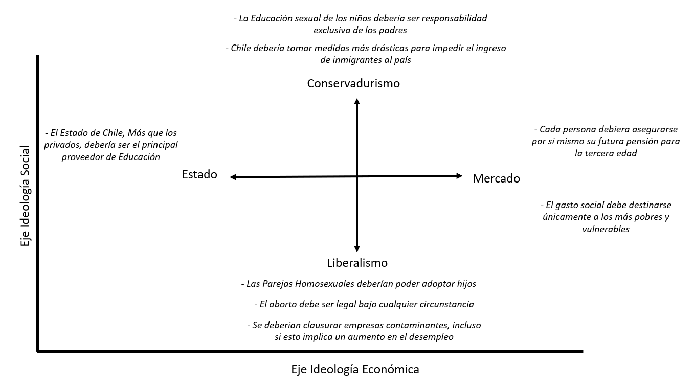

# Perfiles Ideológicos de los Chilenos 
Más allá del eje izquierda-derecha ¿Cómo se estructura la ideología política de los chilenos?

Ante el escenario político "líquido" que ha experimentado Chile durante la última década, surge la pregunta de cómo se estructura hoy el mapa ideológico de los chilenos. Si bien el eje izquierda-derecha tiene una larga historia en el ordenamiento de los partidos políticos chilenos, cerca de un tercio de la población no se identifica hoy con esta representación el 2019. La emergencia de nuevos actores y movimientos sociales refuerzan la necesidad de buscar más y nuevas herramientas interpretativas que permitan analizar con mayor profundidad la complejidad ideológica de la población.

## Clases latentes: Motivación


Ante el escenario político "líquido" que ha experimentado Chile durante la última década, surge la pregunta de cómo se estructura hoy el mapa ideológico de los chilenos. Si bien el eje izquierda-derecha tiene una larga historia en el ordenamiento de los partidos políticos chilenos, cerca de un tercio de la población no se identifica hoy con esta representación el 2019. La emergencia de nuevos actores y movimientos sociales refuerzan la necesidad de buscar más y nuevas herramientas interpretativas que permitan analizar con mayor profundidad la complejidad ideológica de la población.


Inspirados en las conceptualizaciones de @feldman_Understanding_2014, en ELSOC 2019 se incorporaron una serie de preguntas orientadas a evaluar distintas preferencias acerca de diversos temas políticos de relevancia nacional referidos a cuestiones socio-económicos y moral-culturales. A los encuestados se les consultó su nivel de acuerdo con las frases que se presentan en la siguiente lámina.


### Batería de preguntas

- Las parejas homosexuales deberían poder adoptar hijos
- El aborto debe ser legal bajo cualquier circunstancia
- El Estado de Chile, más que los privados, debería ser el principal proveedor de educación
- Cada persona debiera asegurarse por sí mismo su futura pensión para la tercera edad
- Chile debería tomar medidas más drásticas para impedir el ingreso de inmigrantes al país
- La educación sexual de los niños debería ser responsabilidad exclusiva de los padres
- Se deberían clausurar empresas contaminantes, incluso si esto implica un aumento en el desempleo
- El gasto social debe destinarse únicamente a los más pobres y vulnerables

## Modelo teórico de perfiles ideólogicos
```{r out.width = '90%', echo = FALSE, fig.align = 'center'}

```


### Aproximación Empírica

Con el propósito de indagar si existen patrones comunes de respuestas dadas por los ciudadanos a las cuestiones socio-económicos y moral-culturales que permitan identificar posibles grupos, se realizó un análisis de clases latentes (BIC=23.294,67).


De este análisis de identificaron cuatro clases que se diferencian entre sí, y que para efectos de describirlas las hemos llamado Progresistas, Liberales bisagra, Conservadores pro-estado, Conservadores pro-mercado.

### Perfiles ideológicos: Resultados principales

Como puede observarse en la Figura \@ref(fig:perfiles-ideo), los progresistas corresponden al 24% de los entrevistados, y se caracterizan, más que ningún otro grupo, por apoyar un rol más activo del Estado en la provisión de servicios públicos de carácter más bien universalistas y con componentes solidarios. Al mismo tiempo adoptan muy mayoritariamente posiciones liberales en el plano moral-cultural, como es en el caso del aborto, o la adopción homoparental. El opuesto ideológico de este grupo son los Conservadores pro-mercado, correspondientes al 37%, quienes favorecen posiciones conservadoras en el plano moral (p. ej. que la educación sexual sea responsabilidad exclusiva de los padres), y respaldan políticas sociales focalizadas y la responsabilidad individual en pensiones. También son el grupo que más respalda la idea de que el país debe impedir mayormente el ingreso de inmigrantes al país.


Los Conservadores pro-estado, que alcanzan el 21% de la muestra, muestran bajos niveles de apoyo a políticas moral-culturales liberales, e incluso más bajos que sus contrapartes pro-mercado, pero también muestran menor apoyo a políticas sociales focalizadas o la responsabilidad individual en pensiones. Por último, los liberales bisagra (18%) tienden a adoptar posiciones intermedias entre los Progresistas y Conservadores. Se muestran más liberales en el plano moral-cultural que los Conservadores, pero también manifiestan mayor apoyo a la expansión de las capacidades del Estado, aunque no con la misma intensidad que los Progresistas.


A pesar de las grandes diferencias observables en los patrones de respuesta entre las clases, las opiniones referidas a educación pública y protección del medio ambiente muestran consensos muy claros en todos los grupos.


La composición socioeconómica e ideológica de los tipos de ciudadanos son marcadamente diferentes. Tal como se muestra en las Figuras \@ref(fig:educ-perfiles) y \@ref(fig:pospol-perfiles), los progresistas tienen, en promedio, un nivel educativo alto (56% con educación superior técnica o universitaria), y una mayoría se identifica ideológicamente como de izquierda (44%) o centro (23%). Los conservadores, ya sean pro-estado o pro-mercado, tienen un nivel educacional más bajo (63% y 77%, respectivamente, tiene educación secundaria completa o menos), y son ideológicamente variados con presencia relevante en todos los grupos ideológicos, aunque algo menor en la izquierda, y algo mayor entre los que no se identifican. Los Liberales Bisagra, nuevamente, se ubican en una posición intermedia en ambas dimensiones.


Por último, las clases también muestran niveles muy variables de preferencia por el régimen democrático. Mientras este alcanza un 76% de apoyo entre los Progresistas, se reduce a un 62% entre Conservadores pro-estado, a un 60% entre Liberales Bisagra, y un 46% entre Conservadores pro-mercado (ver Figura \@ref(fig:prefdem-perfiles)).

<!-- ### 4.1 Perfiles ideológicos de los chilenos (2019) -->

```{r perfiles-ideo, fig.height=7.5, fig.cap="Perfiles ideológicos de los chilenos (2019)"}
lcmodel$clases2 <- factor(lcmodel$clases, levels=c("Progresistas","Liberales B",
                                                "Conservadores E","Conservadores M"),
                        labels = c("Progresistas (24%)", "Liberales Bisagra (18%)",
                                   "Conservadores pro-Estado (21%)","Conservadores pro-Mercado (37%)"))


ggplot(lcmodel,
       aes(x = vars, y = value, fill = respuestas)) +
       geom_bar(stat = "identity", position = "stack") +
       facet_wrap(clases2 ~ .,strip.position = "top",ncol=4) +
       labs(x= element_blank(), y = element_blank(), fill = element_blank())+
  guides(fill = guide_legend(reverse=TRUE)) +
  scale_fill_viridis_d(begin = 0.25,
                       end = .9, 
                       direction = -1,
                       option = 'viridis') +
  theme_bw(base_size = 10) +
  theme(text = element_text(size=16),
        legend.position = 'top') +
  scale_x_discrete(limits=c("Educación Sexual","Pensiones",
       "Gasto Social","Inmigración","Aborto","Adopción Homoparental","Medio Ambiente","Educación Pública"),
                   labels= c("Educación Pública"="Prioridad \n Educ. Pública","Medio Ambiente"="Cerrar Empresas \n Contaminantes",
                             "Adopción Homoparental"="Apoyo Adopción \n Homoparental", "Aborto"="Apoyo Aborto",
                             "Inmigración"= "Impedir \n Inmigración", "Gasto Social"="Apoyo Gasto \n Social Focalizado",
                             "Pensiones"="Respons. Individual \n en Pensiones", 
                             "Educación Sexual"="Respons. Padres \n Educ. Sexual")) +
  scale_y_continuous(labels = scales::percent) +
  coord_flip()

```
>  **Nota:**  Resultados sin ponderar. N = 2.085


<!-- ### 4.2. Sexo, según Perfiles ideológicos de los chilenos (2019) -->
```{r sexo-perfiles, fig.align='center', fig.cap="Sexo, según Perfiles ideológicos de los chilenos (2019)"}
baseCL$CL <- factor(baseCL$CL,
                    labels = c('Progresistas', 'Liberales Bisagra', 'Conservadores Pro-Estado', 'Conservadores Pro-Mercado'))

n4.2 <- gr.bar.freq("m0_sexo", var_x = "CL", data= baseCL, posicion = 'stack')
n4.2
```


>  **Nota:**  Resultados Ponderados (con Diseño Muestral Complejo). N = `r getN(n4.2, NULL)`

<!-- ### 4.3 Tramo etáreo, según Perfiles ideológicos de los chilenos (2019) -->
```{r edad-perfiles, fig.align='center',fig.cap="Tramo etáreo, según Perfiles ideológicos de los chilenos (2019)"}
n4.3<- gr.bar.freq("edadt", var_x = "CL", data= baseCL, posicion = 'stack', reverse_y =T, colores = c(0,.85,1))
n4.3
```


>  **Nota:**  Resultados Ponderados (con Diseño Muestral Complejo). N = `r getN(n4.3, NULL)`

<!-- ### 4.4 Nivel educacional, según Perfiles ideológicos de los chilenos (2019) -->
```{r educ-perfiles, fig.align='center',fig.cap="Nivel educacional, según Perfiles ideológicos de los chilenos (2019)"}
n4.4<- gr.bar.freq("educ", var_x = "CL", data= baseCL, posicion = 'stack', reverse_y =T)
n4.4
```


>  **Nota:**  Resultados Ponderados (con Diseño Muestral Complejo). N = `r getN(n4.4, NULL)`

<!-- ### 4.5 Religión, según Perfiles ideológicos de los chilenos (2019) -->
```{r relig-perfiles, fig.align='center',fig.cap="Religión, según Perfiles ideológicos de los chilenos (2019)"}
n4.5<- gr.bar.freq("relig", var_x = "CL", data= baseCL, posicion = 'stack', reverse_y =T, colores = c(0,.85,1))
n4.5
```


>  **Nota:**  Resultados Ponderados (con Diseño Muestral Complejo). N = `r getN(n4.5, NULL)`

<!-- ### 4.6 Posición política, según Perfiles ideológicos de los chilenos (2019) -->
```{r pospol-perfiles,echo=FALSE, fig.cap="Posición política, según Perfiles ideológicos de los chilenos (2019)"}
n4.6<- gr.bar.freq("idpoli", var_x = "CL", data= baseCL, posicion = 'stack', reverse_y = T)
n4.6
```


>  **Nota:**  Resultados Ponderados (con Diseño Muestral Complejo). N = `r getN(n4.6, NULL)`

<!-- ### 4.7 Interés en política, según Perfiles ideológicos de los chilenos (2019) -->
```{r intpol-perfiles,fig.cap="Interés en política, según Perfiles ideológicos de los chilenos (2019)"}
n4.7<- gr.bar.freq("c13", data = baseCL, var_x = "CL", posicion = 'stack')
n4.7
```


>  **Nota:**  Resultados Ponderados (con Diseño Muestral Complejo). N = `r getN(n4.7, NULL)`

<!-- ### 4.8 Satisfacción con la Democracia, según Perfiles ideológicos de los chilenos (2019) -->
```{r satisf-perfiles,fig.cap="Satisfacción con la Democracia, según Perfiles ideológicos de los chilenos (2019)"}
n4.8<- gr.bar.freq("c01", data = baseCL, var_x = "CL", posicion = 'stack')
n4.8
```


>  **Nota:**  Resultados Ponderados (con Diseño Muestral Complejo). N = `r getN(n4.8, NULL)`

<!-- ### 4.9 Preferencia por la Democracia, según Perfiles ideológicos de los chilenos (2019) -->
```{r prefdem-perfiles,echo=FALSE,fig.cap="Preferencia por la Democracia, según Perfiles ideológicos de los chilenos (2019)"}
n4.9<- gr.bar.freq("c25", data = baseCL, var_x = "CL", posicion = 'stack')
n4.9
```


>  **Nota:**  Resultados Ponderados (con Diseño Muestral Complejo). N = `r getN(n4.9, NULL)`

<!-- ### 4.10 Consistencia durante las 4 olas en Posición política, según Perfiles ideológicos de los chilenos (2019) -->
```{r conspol-perfiles,fig.cap="Consistencia durante las 4 olas en Posición política, según Perfiles ideológicos de los chilenos (2019)"}
n4.10<- gr.bar.freq("identidad.pospoli.long", var_x = "CL", data= baseCL, posicion = 'stack', reverse_y = T)
n4.10
```
>  **Nota:**  Resultados Ponderados (con Diseño Muestral Complejo). N = `r getN(n4.10, NULL)`

<!-- ### 4.11 Consistencia durante las 4 olas en Identificación partidaria, según Perfiles ideológicos -->
```{r idpart-perfiles,fig.cap="Consistencia durante las 4 olas en Identificación partidaria, según Perfiles ideológicos"}
n4.11<- gr.bar.freq("identidad.parti.long", var_x = "CL", data= baseCL, posicion = 'stack', reverse_y = T)
n4.11
```


>  **Nota:**  Resultados Ponderados (con Diseño Muestral Complejo). N = `r getN(n4.11, NULL)`

<!-- ### 4.12 Consistencia durante las 4 olas en Identificación con coaliciones política, según Perfiles ideológicos (2019) -->
```{r idcol-perfiles,fig.cap="Consistencia durante las 4 olas en Identificación con coaliciones política, según Perfiles ideológicos (2019)"}
n4.12<- gr.bar.freq("identidad.coali.long", var_x = "CL", data= baseCL, posicion = 'stack')
n4.12
```
>  **Nota:**  Resultados Ponderados (con Diseño Muestral Complejo). N = `r getN(n4.12, NULL)`

<!-- ### 4.13 Niveles de confianza social, según Perfiles ideológicos de los chilenos (2019) -->
```{r socconf-perfiles, message=FALSE, warning=FALSE,fig.cap="Niveles de confianza social, según Perfiles ideológicos de los chilenos (2019)"}
library(car)
#Confianza Social 1 - Confianza Social Generalizada
baseCL$confsoc1 <- recode(as.numeric(baseCL$c02), "1=3; 2=1; 3=2")
#Confianza Social 2 - Altruismo Social Generalizado
baseCL$confsoc2 <- recode(as.numeric(baseCL$c03), "1=3; 2=1; 3=2")
#Confianza Social 3 - Mayoria de la gente trata de ser justa
baseCL$confsoc3 <- recode(as.numeric(baseCL$c04), "1=1; 2=3; 3=2")
#Indicadores
baseCL$confsoc <- baseCL$confsoc1 + baseCL$confsoc2 + baseCL$confsoc3
baseCL$confsoc <- recode(baseCL$confsoc, "3=1; 4:6=2; 7:9=3")
baseCL$confsoc_rec <- recode(baseCL$confsoc, "3=1;else=0",as.factor = T)
baseCL$confsoc <- factor(baseCL$confsoc,levels = c(1,2,3),labels = c("Baja", "Media", "Alta")) 
```


```{r confsoc}
n4.13<- gr.bar.freq("confsoc", var_x = "CL", data= baseCL, posicion= 'stack')
n4.13
```


>  **Nota:**  Resultados Ponderados (con Diseño Muestral Complejo). N = `r getN(n4.13, NULL)`
