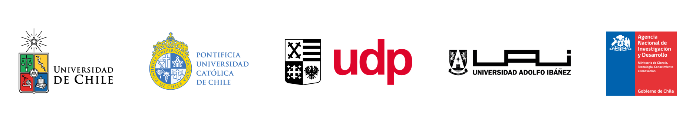
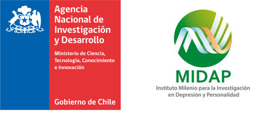

```{r setup, include=FALSE}
knitr::opts_chunk$set(warning = FALSE,message = FALSE, cache = TRUE,
                      # out.width = '100%',
                      fig.pos= "H",fig.align = 'center', fig.width = 15,fig.height =7) 
# knitr::opts_knit$set(base.url = "../") #relative path for .html output file
# knitr::opts_knit$set(root.dir = "../") #relative path for chunks within .rmd files
options(scipen=999)
rm(list=ls())
options(knitr.kable.NA = '',linesep = "")
options(knitr.graphics.error = FALSE)
Sys.setlocale("LC_ALL", "ES_ES.UTF-8")
```

```{r message=FALSE, warning=FALSE, include=FALSE, echo=FALSE,cache=FALSE} 
pacman::p_load(knitr, kableExtra, dplyr,gridExtra,tidyverse,sjmisc,sjlabelled,sticky,ggrepel,ggalluvial,survey,spatstat,readxl,forcats)
```

```{r cargar objetos, include=FALSE, cache = FALSE}
#Para la sección de clases latentes
load("inputs/data/ACL_idpoli_bases.RData")
#Mapa de variables + bases
load("inputs/data/datos_y_funciones/datos_a_usar.RData")
# Funciones
load("inputs/data/datos_y_funciones/funciones_a_usar.RData")
```


```{r echo=FALSE }
table_format = if(is_html_output()) {
  "html"
} else if(is_latex_output()) {
  "latex" 
}

fullw = if(is_html_output()) {T} else if(is_latex_output()) {F}
fsize = if(is_html_output()) {14} else if(is_latex_output()) {8}

ggplot2::theme_set(new = theme_test(base_family = "serif"))
```

# Introducción al reporte

```{r out.width = '70%', echo = FALSE, fig.align = 'center'}
 
```


El Centro de Estudios de Conflicto y Cohesión Social (COES) desarrolla investigación colaborativa en temas relacionados al conflicto social y la cohesión (convivencia) en Chile, por medio de un equipo multidisciplinario proveniente de las ciencias sociales y humanidades. COES centra sus actividades académicas y de difusión en el análisis de las múltiples manifestaciones del conflicto y cohesión social en Chile, sus causas, así como también su contexto cultural e histórico.


COES está patrocinado por la Universidad de Chile y la Pontificia Universidad Católica de Chile, y como instituciones asociadas se encuentran la Universidad Diego Portales y la Universidad Adolfo Ibáñez. COES cuenta con el apoyo del Fondo de Financiamiento de Centros de Investigación en Áreas Prioritarias (FONDAP, dependiente de la Agencia Nacional de Investigación y Desarrollo (ANID) del Ministerio de Ciencia, Tecnología, Conocimiento e Innovación. ELSOC además cuenta como socio al Instituto Milenio para la Investigación en Depresión y Personalidad (MIDAP).


```{r out.width = '30%', echo = FALSE, fig.align = 'center'}
 
```

**Cómo citar este informe:**

> COES (2020) Radiografía del Cambio Social: Análisis de Resultados Longitudinales ELSOC 2016-2019. Presentación de Resultados COES. Septiembre, Santiago de Chile.

```{bibtex,eval=F,include=T}
@techreport{coes_Radiografia_2020,
  title = {Radiograf\'ia Del {{Cambio Social}}: {{An\'alisis}} de {{Resultados Longitudinales ELSOC}} 2016-2019.},
  author = {COES},
  year = {2020},
  month = sep,
  address = {{Santiago de Chile, Chile}},
  institution = {{Centro de Estudios de Conflicto y Cohesi\'on Social}}
}

```


## Equipo Ejecutivo

**Roberto González**

Profesor Titular Escuela de Psicología PUC. Investigador Principal COES

**Matías Bargsted**

Profesor Asociado Instituto de Sociología PUC. Investigador Asociado COES

**Héctor Carvacho**

Profesor Asistente Escuela de Psicología PUC. Investigador Adjunto COES

**Daniel Miranda**

Investigador Centro Medición MIDE UC. Investigador Adjunto COES


**Edgardo Cerda**

Coordinador Técnica ELSOC

**Monserratt Mella**

Coordinadora Técnica ELSOC

**Alejandro Plaza**

Coordinador Técnica ELSOC


## Directorio Técnico

**Dante Contreras**

Profesor Titular Departamento de Economía UCH. 
Investigador Principal COES

**Juan Carlos Castillo**

Profesor Asociado Departamento de Sociología UCH. 
Investigador Principal COES


**Valentina Paredes**

Profesora Asistente Departamento de Economía UCH. 
Investigadora Asociada COES

**Matías Garretón**

Investigador Centro de Inteligencia Territorial UAI. 
Investigador Asociado COES


## Investigadores Colaboradores 


**Dimensiones Socioeconómicas del Conflicto**

Valentina Paredes 

Francisco Pino


**Interacciones Grupales e Individuales**

Roberto González

Daniel Miranda 

Mónica Gerber 

Luis Maldonado 

Ignacio Madero 

Héctor Carvacho 

Gloria Jiménez


**Conflicto Político y Social**

Matías Bargsted

Nicolás Somma 


**Geografías del Conflicto**

María Luisa Méndez  

Nincen Figueroa 

**Otros/as Académicos/as Colaboradores/as**

Ignacia Abufhele 

Tomás Campos 

Carlos Delgado 

Julio Iturra 

Javiera Pizarro 

Salvador Vargas 

## Presentación del Estudio 


El Centro de Estudios de Conflicto y Cohesión Social (COES) tiene el agrado de publicar el informe “Radiografía del Cambio Social”, el cual consolida los principales hallazgos longitudinales de cuatro mediciones anuales del Estudio Longitudinal Social de Chile (ELSOC 2016-2019).


ELSOC es una encuesta desarrollada para analizar longitudinalmente, en un estudio panel, la evolución del conflicto y cohesión social en la sociedad chilena, basándose en modelos conceptuales descritos en la literatura nacional e internacional de las disciplinas del ámbito de la Economía, Sociología, Psicología, Ciencia Política y Estudios Urbanos. De este modo, se orienta a examinar los principales antecedentes, factores moderadores y mediadores, así como las principales consecuencias asociadas al desarrollo de distintas formas de sociabilidad en Chile.


A fines del año 2019 y principios del 2020, Chile experimentó el estallido social más grande de las últimas tres décadas. Tomando como antecedente los últimos tres años, el presente informe caracteriza los principales patrones de estabilidad y cambio de las creencias, actitudes y percepciones que tienen los chilenos. Las consecuencias del estallido social a nivel político y social hoy son inconmensurables, pero consideramos que estudios como ELSOC permitirán a los investigadores y al público general tener un mapa global de las principales transformaciones y sus cristalizaciones en el tiempo.


Deseamos agradecer a cada uno de los investigadores e investigadoras de COES que han participado en el diseño e implementación de ELSOC. Un estudio de la complejidad de ELSOC no sería posible sin el compromiso de toda la comunidad de investigadores del Centro. Adicionalmente, agradecemos el apoyo y financiamiento de ANID y su programa FONDAP, sin los cuales no sería posible implementar una encuesta con los estándares que exige este tipo de estudios.


Agradecemos también al aporte que ha hecho el Instituto Milenio para la Investigación en Depresión y Personalidad (MIDAP) al desarrollo del estudio. Agradecemos especialmente a todas las personas que han participado activamente en las cuatro mediciones ya realizadas en este estudio. Ellas nos han provisto de la información necesaria para poder analizar cómo y en qué aspectos ha ido evolucionando nuestra sociedad durante estos últimos cuatro años.


Invitamos a todos los investigadores, estudiantes, tomadores de decisiones y a la opinión pública en general, a conocer principales resultados del estudio reportados en este informe. Esperamos que esta información nutra la reflexión académica y de la ciudadanía en torno a la manera como han evolucionado nuestras creencias, actitudes y percepciones que tenemos los chilenos y chilenas respecto de la convivencia y del conflicto en nuestra sociedad.


      
Roberto González

Investigador Principal COES

Coordinador Equipo ELSOC


