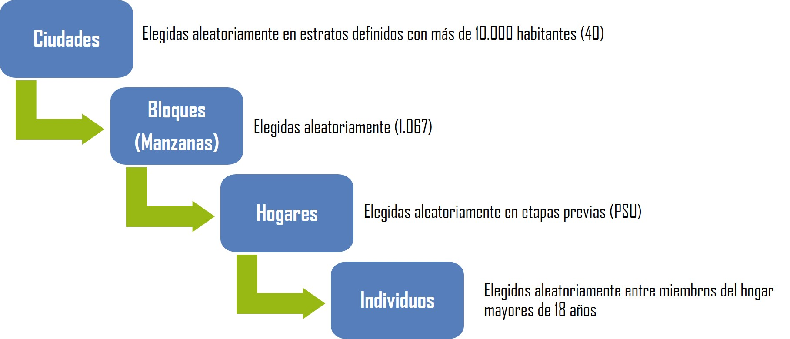
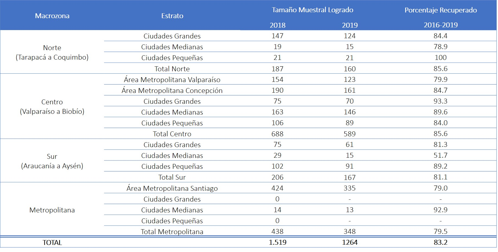

```{r setup, include=FALSE}
knitr::opts_chunk$set(warning = FALSE,message = FALSE, cache = TRUE,
                      # out.width = '100%',
                      fig.pos= "H",fig.align = 'center', fig.width = 15,fig.height =7) 
# knitr::opts_knit$set(base.url = "../") #relative path for .html output file
# knitr::opts_knit$set(root.dir = "../") #relative path for chunks within .rmd files
options(scipen=999)
rm(list=ls())
options(knitr.kable.NA = '',linesep = "")
options(knitr.graphics.error = FALSE)
Sys.setlocale("LC_ALL", "ES_ES.UTF-8")
```

```{r message=FALSE, warning=FALSE, include=FALSE, echo=FALSE,cache=FALSE} 
pacman::p_load(knitr, kableExtra, dplyr,gridExtra,tidyverse,sjmisc,sjlabelled,sticky,ggrepel,ggalluvial,survey,spatstat,readxl,forcats)
```

```{r cargar objetos, include=FALSE, cache = FALSE}
#Para la sección de clases latentes
load("inputs/data/ACL_idpoli_bases.RData")
#Mapa de variables + bases
load("inputs/data/datos_y_funciones/datos_a_usar.RData")
# Funciones
load("inputs/data/datos_y_funciones/funciones_a_usar.RData")
```


```{r echo=FALSE }
table_format = if(is_html_output()) {
  "html"
} else if(is_latex_output()) {
  "latex" 
}

fullw = if(is_html_output()) {T} else if(is_latex_output()) {F}
fsize = if(is_html_output()) {14} else if(is_latex_output()) {8}
```

# Introducción al reporte

```{r out.width = '70%', echo = FALSE, fig.align = 'center'}
knitr::include_graphics("inputs/images/logos.png") 
```


El Centro de Estudios de Conflicto y Cohesión Social (COES) desarrolla investigación colaborativa en temas relacionados al conflicto social y la cohesión (convivencia) en Chile, por medio de un equipo multidisciplinario proveniente de las ciencias sociales y humanidades. COES centra sus actividades académicas y de difusión en el análisis de las múltiples manifestaciones del conflicto y cohesión social en Chile, sus causas, así como también su contexto cultural e histórico.


COES está patrocinado por la Universidad de Chile y la Pontificia Universidad Católica de Chile, y como instituciones asociadas se encuentran la Universidad Diego Portales y la Universidad Adolfo Ibáñez. COES cuenta con el apoyo del Fondo de Financiamiento de Centros de Investigación en Áreas Prioritarias (FONDAP, dependiente de la Agencia Nacional de Investigación y Desarrollo (ANID) del Ministerio de Ciencia, Tecnología, Conocimiento e Innovación. ELSOC además cuenta como socio al Instituto Milenio para la Investigación en Depresión y Personalidad (MIDAP).


```{r out.width = '30%', echo = FALSE, fig.align = 'center'}
knitr::include_graphics("inputs/images/anid_midap.png") 
```

## Equipo Ejecutivo

**Roberto González**

Profesor Titular Escuela de Psicología PUC. Investigador Principal COES

**Matías Bargsted**

Profesor Asociado Instituto de Sociología PUC. Investigador Asociado COES

**Héctor Carvacho**

Profesor Asistente Escuela de Psicología PUC. Investigador Adjunto COES

**Daniel Miranda**

Investigador Centro Medición MIDE UC. Investigador Adjunto COES


**Edgardo Cerda**

Coordinador Técnica ELSOC

**Monserratt Mella**

Coordinadora Técnica ELSOC

**Alejandro Plaza**

Coordinador Técnica ELSOC


## Directorio Técnico

**Dante Contreras**

Profesor Titular Departamento de Economía UCH. 
Investigador Principal COES

**Juan Carlos Castillo**

Profesor Asociado Departamento de Sociología UCH. 
Investigador Principal COES


**Valentina Paredes**

Profesora Asistente Departamento de Economía UCH. 
Investigadora Asociada COES

**Matías Garretón**

Investigador Centro de Inteligencia Territorial UAI. 
Investigador Asociado COES


## Investigadores Colaboradores 


**Dimensiones Socioeconómicas del Conflicto**

Valentina Paredes 

Francisco Pino


**Interacciones Grupales e Individuales**

Roberto González

Daniel Miranda 

Mónica Gerber 

Luis Maldonado 

Ignacio Madero 

Héctor Carvacho 

Gloria Jiménez


**Conflicto Político y Social**

Matías Bargsted

Nicolás Somma 


**Geografías del Conflicto**

María Luisa Méndez  

Nincen Figueroa 

**Otros/as Académicos/as Colaboradores/as**

Ignacia Abufhele 

Tomás Campos 

Carlos Delgado 

Julio Iturra 

Javiera Pizarro 

Salvador Vargas 

## Presentación del Estudio 


El Centro de Estudios de Conflicto y Cohesión Social (COES) tiene el agrado de publicar el informe “Radiografía del Cambio Social”, el cual consolida los principales hallazgos longitudinales de cuatro mediciones anuales del Estudio Longitudinal Social de Chile (ELSOC 2016-2019).


ELSOC es una encuesta desarrollada para analizar longitudinalmente, en un estudio panel, la evolución del conflicto y cohesión social en la sociedad chilena, basándose en modelos conceptuales descritos en la literatura nacional e internacional de las disciplinas del ámbito de la Economía, Sociología, Psicología, Ciencia Política y Estudios Urbanos. De este modo, se orienta a examinar los principales antecedentes, factores moderadores y mediadores, así como las principales consecuencias asociadas al desarrollo de distintas formas de sociabilidad en Chile.


A fines del año 2019 y principios del 2020, Chile experimentó el estallido social más grande de las últimas tres décadas. Tomando como antecedente los últimos tres años, el presente informe caracteriza los principales patrones de estabilidad y cambio de las creencias, actitudes y percepciones que tienen los chilenos. Las consecuencias del estallido social a nivel político y social hoy son inconmensurables, pero consideramos que estudios como ELSOC permitirán a los investigadores y al público general tener un mapa global de las principales transformaciones y sus cristalizaciones en el tiempo.


Deseamos agradecer a cada uno de los investigadores e investigadoras de COES que han participado en el diseño e implementación de ELSOC. Un estudio de la complejidad de ELSOC no sería posible sin el compromiso de toda la comunidad de investigadores del Centro. Adicionalmente, agradecemos el apoyo y financiamiento de ANID y su programa FONDAP, sin los cuales no sería posible implementar una encuesta con los estándares que exige este tipo de estudios.


Agradecemos también al aporte que ha hecho el Instituto Milenio para la Investigación en Depresión y Personalidad (MIDAP) al desarrollo del estudio. Agradecemos especialmente a todas las personas que han participado activamente en las cuatro mediciones ya realizadas en este estudio. Ellas nos han provisto de la información necesaria para poder analizar cómo y en qué aspectos ha ido evolucionando nuestra sociedad durante estos últimos cuatro años.


Invitamos a todos los investigadores, estudiantes, tomadores de decisiones y a la opinión pública en general, a conocer principales resultados del estudio reportados en este informe. Esperamos que esta información nutra la reflexión académica y de la ciudadanía en torno a la manera como han evolucionado nuestras creencias, actitudes y percepciones que tenemos los chilenos y chilenas respecto de la convivencia y del conflicto en nuestra sociedad.


      
Roberto González

Investigador Principal COES

Coordinador Equipo ELSOC


<!--chapter:end:index.Rmd-->

---
editor_options: 
  markdown: 
    wrap: 72
---


# Ficha Técnica

- Diseño: Estudio cuantitativo por medio de un cuestionario estructurado.

- Periodicidad: Anual. 

- Diseño Longitudinal: panel repetido (misma encuesta se aplica a dos muestras independientes). Segunda muestra se implementó a partir del tercer año de medición (2018).

- Período de Aplicación: entre Julio y Noviembre de cada año. Cuarta medición se aplico entre el 21 de noviembre de 2019 y el 9 de marzo de 2020

- Instrumento: Cuestionario compuesto por preguntas cerradas de carácter simple y múltiple junto a algunas preguntas abiertas. Combina módulos de preguntas permanentes (medidas en todas las olas) y otras intercaladas entre olas.

- Cobertura Temática: Contiene siete módulos temáticos: Territorio, Redes y actitudes sociales, Ciudadanía y democracia, Desigualdad y legitimidad, Conflicto social, Salud y bienestar y Caracterización sociodemográfica.

## Dimension longitudinal del Diseño

```{r echo=FALSE, fig.align='center', fig.height=1, out.height="150%", out.width="150%"}

```

- Unidad de Análisis: Individuos.

- Población Objetivo: Hombres y mujeres de 18 a 75 años, residentes habituales de viviendas particulares ocupadas en zonas urbanas, localizadas en 40 ciudades (92 comunas, 13 regiones) del país.

- Marco Muestral: Marco de muestreo de manzanas del pre-censo 2011, trabajo elaborado por el Centro de Inteligencia Territorial (CIT) de la Universidad Adolfo Ibáñez.

- Diseño Muestral: Probabilístico, estratificado (por tamaño de ciudades), por conglomerados y multietápico.

- Unidades de Muestreo: Primero se eligen ciudades (UPM), luego manzanas (USM), y sub-bloques y viviendas (UTM). La unidad final de selección es la persona.

## Dimensión Territorial del Diseño Muestral


|               Estrato                | Definición | N° de ciudades en marco muestral | N° de ciuades seleccionadas 	|
| :--- |:--- | :---: | :---: |
| Áreas metropolitana de Santiago    |            | 1   | 1  |
| Áreas metropolitana de Valparaíso  |            | 1   | 1  |
| Áreas metropolitana de Concepción  |            | 1   | 1  |
| Ciudades grandes    | Más de 100.000 habitantes | 18  | 8  |
| Ciudades medianas   | Más de 30.000 habitantes  | 28  | 10 |
| Ciudades pequeñas   | Más de 10.000 habitantes  | 73  | 19 |
|   Total             |                           | 122 | 40 |


# Etapas de Selección en el Diseño Muestral
```{r echo=FALSE, fig.align='center', fig.height=1, out.height="150%", out.width="150%"}

```


**Organismo Ejecutor**: Consultora Stephanie Eckman y Centro de Inteligencia Territorial (CIT) de la Universidad Adolfo Ibáñez (diseño muestral). Centro Micro Datos (CMD) de la Universidad de Chile (levantamiento, procesamiento de la información y construcción de factores de expansión).


**Entrenamiento y Ejecución**: Contratación de entrevistadores con experiencia en encuestas complejas y/o longitudinales. Capacitación centralizada y presencial para coordinadores de campo y un subconjunto de entrevistadores en Santiago (incluidos ejercicios prácticos para la implementación del cuestionario, uso de tabletas y protocolo de contacto). Actividades adicionales en otras regiones de Chile. Diseño de un Manual de entrevistador especializado para el proyecto.


**Operaciones de Control y Supervisión**: Entrega de incentivos monetarios para el encuestado ($ 6.000 CLP) y de material sobre el estudio (ELSOC y COES). Acciones de seguimiento basadas en la información de contacto (correo electrónico para cumpleaños y días festivos). Los coordinadores de campo supervisan el trabajo de los entrevistadores, verificando el número de visitas, el contacto, la identidad del participante y algunas preguntas claves. El Centro Micro Datos realiza una supervisión interna de al menos el 10% de la muestra (entrevistando nuevamente a algunos encuestados), verificando la duración y la respuesta de los participantes.


# Descripción de atrición

ELSOC al ser un estudio panel longitudinal nos permite observar cambios en los individuos a lo largo del tiempo. Sin embargo, esta misma naturaleza del diseño del estudio pone en juego el desafío de retener a los participantes. En este sentido es que cobra importancia observar el proceso de abandono de un estudio panel, denominado atrición. Uno de los aspectos más importante para medir la calidad de los datos en las encuestas de panel es el nivel de atrición, ya que incluso si un panel comienza con una buena representación de la población de interés, las pequeñas tasas de deserción pueden acumularse rápidamente y hacer que la muestra ya no sea representativa, sobretodo cuando la deserción es sesgada. En teoría, deberíamos ser capaces de aprender bastante de las primeras olas de un panel sobre qué políticas de campo funcionan para reducir el desgaste y cuáles no [@hill_Reducing_2001].


## Tamaño muestral

El diseño de ELSOC contempló entrevistar a 3.000 personas en su primera medición, reconociendo que año tras año, se reduciría el número de participantes, dado que algunos optarían voluntariamente por dejar de participar en el estudio y otras personas no podrían ser recontactadas o incluso algunas fallecerían. Este fenómeno es conocido como atrición, y pueden tener efectos nocivos sobre la utilidad de los datos longitudinales. Para cada año se planifica obtener un número de entrevistados (Muestra Objetivo) considerando una proyección de la atrición definida al momento de diseñar el estudio. ELSOC tiene buenos números en este aspecto. Incluso, en 2018 se logró recontactar a un número de participantes mayor al proyectado.


|        Medición       	| Muestra Objetivo 	| Muestra Lograda 	| Porcentaje de Logro 	|
|:---------------------:	|:----------------:	|:---------------:	|:-------------------:	|
| Muestra Original 2016 	|       3000       	|       2927      	|        97.6%        	|
| Muestra Original 2017 	|       2536       	|       2473      	|        97.5%        	|
| Muestra Original 2018 	|       2131       	|       2229      	|        104.6%       	|
| Muestra Original 2019 	|       1790       	|       2153      	|        120.3%       	|
| Muestra Refresco 2018 	|       1500       	|       1519      	|        101.3%       	|
| Muestra Refresco 2019 	|       1275       	|       1264      	|        99.1%        	|


## Atrición de la Muestra Original y Muestra Refresco


|        Medición       | Muestra Lograda | Porcentaje Recuperado | Atrición |
|:---------------------:|:---------------:|:---------------------:|:--------:|
| Muestra Original 2016 |       2927      |           -           |          |
| Muestra Original 2017 |       2473      |         84.5%         |   15.5%  |
| Muestra Original 2018 |       2229      |         90.1%         |   9.9%   |
| Muestra Original 2019 |       2153      |         96.6%         |   3.4%   |
| Muestra Refresco 2018 |       1519      |           -           |          |
| Muestra Refresco 2019 |       1264      |         83.2%         |   16.8%  |


<!-- ## Atrición de la Muestra Original según Territorio -->


```{r atricion-territorio, echo=FALSE, fig.align='center', fig.height=1, out.height="150%", out.width="150%", fig.cap='Atrición de la Muestra Original según Territorio',results='asis'}
# 
options(knitr.kable.NA = '')
col_names <- c("","","2016","2017","2018","2019","2016-2017","2017-2018","2016-2018","2016-2019")
xlsx::read.xlsx(file = "inputs/tables.xlsx",sheetName = "atri-territorio",encoding = "UTF-8",startRow = 2) %>% 
  kable(col.names = col_names,align = "llcccccccc",
        caption = "Atrición de la Muestra Original según Territorio") %>% 
  kable_styling(full_width = F, font_size = 10) %>%  
  add_header_above(c("Macrozona" = 1, "Estrato" = 1, "Tamaño Muestral Logrado" = 4, "Porcentaje Recuperado" = 4))
```


<!-- ## Atrición Muestral Original según sexo y edad* -->

```{r atricion-sexo-edad, echo=FALSE, fig.align='center', fig.height=1, out.height="150%", out.width="150%", fig.cap="Atrición Muestral Original según sexo y edad*"}
# 
col_names <- c("","2016","2017","2018","2019","2016-2017","2017-2018","2016-2018","2016-2019")

xlsx::read.xlsx(file = "inputs/tables.xlsx",sheetName = "atri-sexo-edad",encoding = "UTF-8",startRow = 2) %>% 
  kable(col.names = col_names,align = "lcccccccc",
        caption = "Atrición Muestral Original según sexo y edad",escape = TRUE) %>% 
  kable_styling(full_width = F, font_size = 10) %>%  
  add_header_above(c("Categoría" = 1, "Tamaño Muestral Logrado" = 4, "Porcentaje Recuperado" = 4)) %>% 
  row_spec(row = 4,bold = T) %>% 
  add_footnote(label = "El paso de los años entre olas hace que los sujetos cambien de categoría etaria. El porcentaje recuperado asociado a edad debe considerarse como indicativo.",notation = "symbol")
```

<!-- *El paso de los años entre olas hace que los sujetos cambien de categoría etaria. El porcentaje recuperado asociado a edad debe considerarse como indicativo. -->
 
<!-- ## Atrición de la Muestra refresco según Territorio -->
```{r atricion-ref-territorio, echo=FALSE, fig.align='center', fig.height=1, out.height="150%", out.width="150%",fig.cap="Atrición de la Muestra refresco según Territorio"}
# 
col_names <- c("","","2018","2019","2016-2019") 
xlsx::read.xlsx(file = "inputs/tables.xlsx",sheetName = "atri-refresco-territorio",encoding = "UTF-8",startRow = 2) %>% 
  kable(col.names = col_names,align = "lcccc",
        caption = "Atrición de la Muestra refresco según Territorio",escape = TRUE) %>%  
  kable_styling(full_width = F, font_size = 10) %>%  
  add_header_above(c("Macrozona" = 1, "Estrato" = 1, "Tamaño Muestral Logrado" = 2, "Porcentaje Recuperado" = 1))
```


<!-- ## Atrición de la Muestra Refresco según sexo y edad* -->
```{r atricion-ref-sexo-edad, echo=FALSE, fig.align='center', fig.height=1, out.height="100%", out.width="100%",fig.cap="Atrición de la Muestra Refresco según sexo y edad*"}
#  
col_names <- c("","2018","2019","2018-2019") 

xlsx::read.xlsx(file = "inputs/tables.xlsx",sheetName = "atri-refresxo-sex-edad",encoding = "UTF-8",startRow = 2) %>% 
  kable(col.names = col_names,align = "lccc",
        caption = "Atrición de la Muestra Refresco según sexo y edad*",escape = TRUE) %>% 
  kable_styling(full_width = F, font_size = 10) %>%  
  add_header_above(c("Categoría" = 1, "Tamaño Muestral Logrado" = 2, "Porcentaje Recuperado" = 1)) %>% 
  row_spec(row = 4,bold = T) %>% 
  add_footnote(label = "El paso de los años entre olas hace que los sujetos cambien de categoría etaria. El porcentaje recuperado asociado a edad debe considerarse como indicativo.",notation = "symbol")
```

# Composición de la Muestra


ELSOC ha ya completado cuatro mediciones anuales (2016, 2017, 2018 y 2019), lapso temporal dentro del cual es posible analizar la evolución de la sociedad chilena en todas las dimensiones medidas. Antes de proceder a la presentación de los principales hallazgos, este apartado caracteriza sociodemográficamente la muestra bajo estudio. 


A continuación, describimos la muestra original de ELSOC en sus mediciones 2016 (N = 2.927), 2017 (N = 2.473), 2018 (N = 2.229) y 2019 (N = 2.153), según sexo, edad, educación, religión y zona de residencia. Todos los resultados presentados incorporan las principales características del diseño muestral complejo del estudio. Es decir, Se utiliza el ponderador muestral ajustado a población regional y sexo, estrato y conglomerado muestral.

<!-- ##  Composición de Muestra según sexo y ola del estudio -->
```{r m0-sexo, echo=FALSE, fig.align='center',fig.cap=" Composición de Muestra según sexo y ola del estudio"}
gr.bar.n('m0_sexo', 'ola', 'muestra', data = elsoc_long, limits_y=c(0,3000), posicion = 'stack')
```

>  **Nota:**  Resultados Ponderados (con Diseño Muestral Complejo) 


<!-- ##  Composición de Muestra según edad y ola del estudio -->
```{r edadt, echo=FALSE, fig.align='center',fig.cap="Composición de Muestra según edad y ola del estudio"}
gr.bar.n('edadt', 'ola', 'muestra', data = elsoc_long, limits_y=c(0,3000), posicion = 'stack')
```

>  **Nota:**  Resultados Ponderados (con Diseño Muestral Complejo) 

<!-- ##  Composición de Muestra según educación y ola del estudio -->
```{r educ, echo=FALSE, fig.align='center',fig.cap="Composición de Muestra según educación y ola del estudio"}
gr.bar.n('educ', 'ola', 'muestra', data = elsoc_long, limits_y=c(0,3000), posicion = 'stack')
```

>  **Nota:**  Resultados Ponderados (con Diseño Muestral Complejo) 

<!-- ##  Composición de Muestra según religión y ola del estudio -->
```{r relig, echo=FALSE, fig.align='center',fig.cap="Composición de Muestra según religión y ola del estudio"}
gr.bar.n('relig', 'ola', 'muestra', data = elsoc_long, limits_y=c(0,3000), posicion = 'stack')
```

>  **Nota:**  Resultados Ponderados (con Diseño Muestral Complejo) 

<!-- ## Composición de Muestra según zona de residencia y ola del estudio -->
```{r estrato, echo=FALSE, fig.align='center',fig.cap="Composición de Muestra según zona de residencia y ola del estudio"}
gr.bar.n('estrato', 'ola', 'muestra', data = elsoc_long, limits_y=c(0,3000), posicion = 'stack')
```

>  **Nota:**  Resultados Ponderados (con Diseño Muestral Complejo) 

<!--chapter:end:02-ficha-tecnica.Rmd-->

---
editor_options: 
  markdown: 
    wrap: 72
---

# Foco en el cambio individual

Radiografía del Cambio Social tiene como objetivo fundamental caracterizar la estabilidad y el cambio en opiniones, actitudes y conductas de los participantes a lo largo del tiempo, enfocándose en distintas dimensiones de la cohesión y conflicto en Chile. 


Para el logro de dicho objetivo, el presente reporte se centrará en un subconjunto de participantes del estudio: los 2096 entrevistados que participaron en las cuatro primeras olas de ELSOC (como parte de la muestra original). Dicha submuestra será la base empírica de los hallazgos expuestos en las siguientes secciones. 


A continuación se describe a este grupo de participantes según los mismos atributos sociodemográficos (sexo, edad, educación, zona de residencia y religión), considerando la primera medición. Todos los resultados presentados incorporan el diseño muestral complejo de la encuesta.

**Nota 1:** El promedio de edad de los participantes se ha incrementado entre estos años. También hay evidencia de un descenso en la identificación religiosa al comparar distintos años del estudio. Las otras variables no presentan variaciones relevantes a lo largo del tiempo.

**Nota 2:** Se utiliza el ponderador muestral ajustado a población regional y sexo, estrato y conglomerado muestral.

<!-- ## Distribución de Sub-Muestra de Participantes en las cuatro olas ELSOC según sexo -->
```{r m0sexo-2019, echo=FALSE, fig.align='center',fig.cap="Distribución de Sub-Muestra de Participantes en las cuatro olas ELSOC según sexo"}
gr.bar.freq("m0_sexo", data = subset(elsoc_panel_m1, ola == 2019))
```


>  **Nota:**  Resultados Ponderados (con Diseño Muestral Complejo) 

<!-- ## Distribución de Sub-Muestra de Participantes en las cuatro olas ELSOC según edad -->
```{r edadt-2019, echo=FALSE, fig.align='center',fig.cap="Distribución de Sub-Muestra de Participantes en las cuatro olas ELSOC según edad"}
gr.bar.freq("edadt", data = subset(elsoc_panel_m1, ola == 2019))
```


>  **Nota:**  Resultados Ponderados (con Diseño Muestral Complejo) 

<!-- ## Distribución de Sub-muestra de Participantes en las cuatro olas ELSOC según Nivel educacional -->
```{r educ-2019, echo=FALSE, fig.align='center',fig.cap="Distribución de Sub-muestra de Participantes en las cuatro olas ELSOC según Nivel educacional"}
gr.bar.freq("educ", data = subset(elsoc_panel_m1, ola == 2019))
```


>  **Nota:**  Resultados Ponderados (con Diseño Muestral Complejo) 


<!-- ## Distribución de Sub-Muestra de Participantes en las cuatro olas ELSOC según zona de residencia -->
```{r estrato-2019, echo=FALSE, fig.align='center',fig.cap="Distribución de Sub-Muestra de Participantes en las cuatro olas ELSOC según zona de residencia"}
gr.bar.freq("estrato", data = subset(elsoc_panel_m1, ola == 2019))
```

>  **Nota:**  Resultados Ponderados (con Diseño Muestral Complejo) 


<!--chapter:end:03-foco-cambio-ind.Rmd-->

---
editor_options: 
  markdown: 
    wrap: 72
---

# Principales hallazgos longitudinales

**Nota Explicativa**

A continuación, se presentan los principales resultados de la encuesta ELSOC elaborados por investigadores del Centro de Conflicto y Cohesión Social (COES). Dada la diversidad de temas que son abordados en la encuesta, los investigadores colaboradores utilizaron diversos enfoques teóricos y herramientas empíricas en su análisis. Sin embargo, en Radiografía del Cambio Social se han definido una serie de criterios comunes para el desarrollo de resultados empíricos:

- Foco en la evolución y cambio en las actitudes de la población, aún cuando en ocasiones se analizan preguntas incluidas en una o dos olas del estudio. 
- Uso de pruebas estadísticas específicas para el análisis longitudinal. 
- Utilización de submuestra de 2.096 participantes del estudio presentes en las cuatro mediciones (2016, 2017, 2018 y 2019). 
- Tamaños muestrales reportados menores se explican exclusivamente por no respuesta a ítemes específicos. 
- Utilización del diseño muestral complejo (ponderador muestral ajustado a población regional y sexo, estrato y conglomerado muestral) en el desarrollo de figuras descriptivas y pruebas inferenciales. 


**Levantamiento durante estallido social**

El año 2019 correspondía levantar la cuarta ola de la Muestra 1 y la segunda ola de la Muestra 2 de ELSOC. El trabajo de terreno estaba programado para iniciarse el sábado 19 de Octubre de 2019, pero debido al estallido social ocurrido el 18 de Octubre, este debió ser suspendido hasta el jueves 21 de noviembre. El trabajo de terreno culminó el 9 de marzo del 2020.

Ante la intensificación de la protesta social, comienza una coyuntura histórica inédita que pone de relieve importantes desafíos políticos y sociales para Chile, y su democracia. En este contexto, COES toma la decisión de incluir una serie de baterías y preguntas específicamente diseñadas para comprender mejor como la opinión pública chilena percibió y experimentó el estallido social, y de esta manera, poder contribuir a un entendimiento más profundo de nuestra sociedad tomando en consideración este periodo de nuestra historia reciente.


<!--chapter:end:04-cambio-long.Rmd-->

---
editor_options: 
  markdown: 
    wrap: 72
---

# Movimientos Sociales y Acciones Colectivas

¿Ha aumentado la participación social en movimientos sociales? ¿Con qué factores se relaciona el aumento en la participación?


Los movimientos sociales han tenido un auge en años recientes, posibilitando la expresión de una amplia gama de demandas ciudadanas en la arena pública. ELSOC consultó cada año por el movimiento social más valorado por el entrevistado, incluyendo en el año 2019 la valoración del Movimiento Social de Octubre.

Los movimientos sociales son muy relevantes en la arena pública ya que, a diferencia de los partidos políticos o gobiernos, son actores bastante variables que se guían por ciclos de actividad irregulares, combinando momentos de auge (con oleadas de protestas colectivas) y periodos de latencia o ausencia en el espacio público. Así, por ejemplo, es que surge el estallido social de Octubre 2019, el cual se desencadena tras un largo y progresivo ciclo de movilización política protagonizado por marchas estudiantiles, de pensiones y feministas.

## Ciclo de movilización política y estallido social

El estallido social se desencadena después de un largo y progresivo ciclo de movilización política protagonizado recientemente por marchas estudiantiles, de pensiones y feministas. ELSOC consultó cada año por el movimiento social más valorado por el entrevistado, incluyendo en 2019 valoración del Movimiento Social de Octubre.


La Figura \@ref(fig:mov) indica que entre el año 2018 y 2019 se produce una reducción importante en el porcentaje de personas que no valoran ningún movimiento social. El descenso de valoración experimentado por el movimiento estudiantil y laboral durante años anteriores también se revierte en el 2019.

La Figura \@ref(fig:freq-mov) refuerza este resultado al mostrar que la participación frecuente en movimientos sociales tiende a ser estable entre los años 2016 y 2018, para luego aumentar en 13 puntos porcentuales durante el año 2019, pasando desde un 21% en 2016 a un 36% en 2019.


<!-- ### 1.1 ¿Cuál es el movimiento social que usted más valora de esta lista? Según ola del estudio  -->
```{r mov, echo=FALSE, fig.align='left',fig.cap="¿Cuál es el movimiento social que usted más valora de esta lista? Según ola del estudio"}
g1.1 <- gr.bar.freq(var_y = 'ola', var_x = 'mov', suma100 = 'y', no_label_texto = T,
                    data = subset(elsoc_panel_m1, ola == 2018 | ola == 2019), expand=T, limits_y = c(0,.4),
                    reverse_x=T, reverse_y = T, posicion_leyenda = 'right', invertir_labels = T,
                    colores = c(.33,.66,1)) +
  coord_flip() + theme(axis.text.x = element_text(size=rel(.9))) +
  scale_x_discrete(labels = waiver())
g1.1

```
>  **Nota:**  Resultados Ponderados (con Diseño Muestral Complejo). N = `r getN(g1.1, 'var_y')` 

<!-- ### 1.2 Frecuencia de participación en movimientos sociales, según Ola de encuesta. Porcentaje que responde A veces, Frecuentemente o Muy frecuentemente  -->
```{r freq-mov, echo=FALSE, fig.align='center', fig.cap="Frecuencia de participación en movimientos sociales, según Ola de encuesta. Porcentaje que responde A veces, Frecuentemente o Muy frecuentemente"}
g1.2 <-  gr.bar.freq.rec.list(c('freq_mov_w04','freq_mov_w03', 'freq_mov_w02', 'freq_mov_w01'),  var_z=NULL,
                              REC = c('A veces', 'Frecuentemente o muy frecuentemente'),
                          data = elsoc_wide_m1, ponderador = 'ponderador02_w04', reverse_y=T,
                          label_x = c('2016', '2017', '2018', '2019'), posicion = 'stack')
g1.2
```

>  **Nota:**  Resultados Ponderados (con Diseño Muestral Complejo). N=`r getN(g1.2)` 

## Estallido social y aumento en la participación en movimientos sociales

El análisis del cambio individual en los niveles de participación en movimientos sociales sugiere cierta estabilidad entre los años 2016 y 2018; en contraste para el año 2019 se produce un marcado incremento desde un 21% que había aumentado su participación entre el 2017 y 2018 a un 39% que lo hace entre los años 2018 y 2019 (Figura \@ref(fig:cambio-freq)).


Este aumento tiende a ser más agudo entre personas jóvenes (18 a 29 años, Figura \@ref(fig:cambio-freq-edad)), con educación superior universitaria (Figura \@ref(fig:cambio-freq-educ)), y particularmente entre aquellos con amigos políticamente activos, sugiriendo un efecto de influencia social normativa (Figura \@ref(fig:cambio-freq-amig)). Las personas con posicionamiento de izquierda y de centro aumentaron la frecuencia de participación entre el 2018 y 2019 en mayor medida que aquellas que se identifican con la derecha o se declaran independientes, cuya tasa de cambio es menor al promedio de la muestra (Figura \@ref(fig:cambio-freq-ideo)).

La Figura \@ref(fig:rabia-miedo)  revela que las personas exhiben amplios sentimientos de rabia por el nivel de desigualdad y el costo de la vida en Chile, así como rabia y miedo hcia el actuar de Carabineros y de Manifestantes violentos en manifestaciones. Tal como lo revela la Figura \@ref(fig:freq-rabia-ineq), la participación en movimientos sociales estuvo asociada positivamente a sentimientos de rabia por los niveles de desigualdad y costo de la vida (mayor participación a medida que aumenta la rabia) (Figura \@ref(fig:freq-rabia-carab) ). Por otro lado, quienes exhibieron menores niveles de rabia o miedo hacia manifestantes violentos mostraron mayores niveles participación en movimientos sociales (Figura \@ref(fig:freq-rabia-violent)).


<!-- ### 1.3 Cambio en Frecuencia de participación en movimientos sociales, según ola de encuesta -->
```{r cambio-freq, echo=FALSE, fig.align='center',fig.cap="Cambio en Frecuencia de participación en movimientos sociales, según ola de encuesta"}
g1.3 <- gr.bar.freq.list(c('cambio_freq_mov_w04','cambio_freq_mov_w03', 'cambio_freq_mov_w02'), 
                         data = elsoc_wide_m1, ponderador = 'ponderador02_w04', reverse_y=T,
                         label_x = c('2016-2017', '2017-2018', '2018-2019'),
                         label_color = c('Disminuye participación','Se mantiene nivel de participación','Aumenta participación'),
                         posicion = 'stack',
                    colores = c(0,.85,1))

g1.3
```


>  **Nota:**  Resultados Ponderados (con Diseño Muestral Complejo). N = `r getN(g1.3)` 


<!-- ### 1.4 Cambio en Frecuencia de participación en movimientos sociales entre 2018 y 2019, según edad del entrevistado -->
```{r cambio-freq-edad, echo=FALSE, fig.align='center',fig.cap="Cambio en Frecuencia de participación en movimientos sociales entre 2018 y 2019, según edad del entrevistado"}
g1.4 <- gr.bar.freq('cambio_freq_mov_w04', var_x = 'edad_w03', data = subset(elsoc_wide_m1), reverse_y=T, ponderador = 'ponderador02_w03',
                 posicion = 'stack',
                    colores = c(0,.85,1))
g1.4
```

>  **Nota:**  Resultados Ponderados (con Diseño Muestral Complejo). N = `r getN(g1.4, NULL)` 

<!-- ### 1.5 Cambio en Frecuencia de participación en movimientos sociales entre 2018 y 2019, según nivel educacional del entrevistado -->
```{r cambio-freq-educ, echo=FALSE, fig.align='center',fig.cap="Cambio en Frecuencia de participación en movimientos sociales entre 2018 y 2019, según nivel educacional del entrevistado"}
g1.5 <- gr.bar.freq('cambio_freq_mov_w04', var_x = 'educ_w03', data = subset(elsoc_wide_m1), reverse_y=T, ponderador = 'ponderador02_w03',
                 posicion = 'stack',
                    colores = c(0,.85,1))
g1.5

```

>  **Nota:**  Resultados Ponderados (con Diseño Muestral Complejo). N = `r getN(g1.5, NULL)`

<!-- ### 1.6 Cambio en Frecuencia de participación en movimientos sociales entre 2018 y 2019, según posición ideológica del entrevistado (de año previo) -->
```{r cambio-freq-ideo, echo=FALSE, fig.align='center', fig.cap="Cambio en Frecuencia de participación en movimientos sociales entre 2018 y 2019, según posición ideológica del entrevistado (de año previo)"}
g1.6 <- gr.bar.freq('cambio_freq_mov_w04', var_x = 'pos_id_w03', 
                    data = subset(elsoc_wide_m1), ponderador = 'ponderador02_w03', reverse_y=T, posicion = 'stack',
                    colores = c(0,.85,1))
g1.6
```

>  **Nota:**  Resultados Ponderados (con Diseño Muestral Complejo). N = `r getN(g1.6, NULL)`


<!-- ### 1.7 Cambio en Frecuencia de participación en movimientos sociales entre 2018 y 2019, según participación de amigos en movimiento social -->
```{r cambio-freq-amig, echo=FALSE, fig.align='center',fig.cap="Cambio en Frecuencia de participación en movimientos sociales entre 2018 y 2019, según participación de amigos en movimiento social"}
elsoc_wide_m1 <- elsoc_wide_m1 %>% 
  mutate(c24_w04_rec = case_when(c24_w04 == '1' | c24_w04 == '2' ~ 1,
                             c24_w04 == '3' ~ 2,
                             c24_w04 == '4' | c24_w04 == '5' ~ 3))

g1.7 <- gr.bar.freq('cambio_freq_mov_w04', var_x = 'c24_w04_rec', 
                    data = subset(elsoc_wide_m1), ponderador = 'ponderador02_w03', reverse_y=T,
                    posicion = 'stack',
                    label_x = c('Nunca o casi nunca', 'A veces', 'Frecuentemente o Muy frecuentemente'),
                    titulo_x = 'Participación de amigos en movimiento social',
                    colores = c(0,.85,1))
g1.7
```

>  **Nota:**  Resultados Ponderados (con Diseño Muestral Complejo). N = `r getN(g1.7, NULL)`


```{r echo = FALSE}
elsoc_wide_m1 <- elsoc_wide_m1 %>% 
  mutate(c41_01_w04_rec = factor(case_when(c41_01_w04 == 1 ~ 1,
                                   c41_01_w04 == 2 | c41_01_w04 == 3 ~2,
                                   c41_01_w04 == 4 | c41_01_w04 == 5 ~3),
                                 labels = c('Nada', 'Poca o Algo', 'Bastante o Mucha')),
         c41_02_w04_rec = factor(case_when(c41_02_w04 == 1 ~ 1,
                                   c41_02_w04 == 2 | c41_02_w04 == 3 ~2,
                                   c41_02_w04 == 4 | c41_02_w04 == 5 ~3),
                                 labels = c('Nada', 'Poca o Algo', 'Bastante o Mucha')))

elsoc_wide_m1 <- elsoc_wide_m1 %>% 
  mutate(c41_04_w04_rec = factor(case_when(c41_04_w04 == 1 ~ 1,
                                   c41_04_w04 == 2 | c41_04_w04 == 3 ~2,
                                   c41_04_w04 == 4 | c41_04_w04 == 5 ~3),
                                 labels = c('Nada', 'Poca o Algo', 'Bastante o Mucha')),
         c42_04_w04_rec = factor(case_when(c42_04_w04 == 1 ~ 1,
                                   c42_04_w04 == 2 | c42_04_w04 == 3 ~2,
                                   c42_04_w04 == 4 | c42_04_w04 == 5 ~3),
                                 labels = c('Nada', 'Poca o Algo', 'Bastante o Mucha')))

elsoc_wide_m1 <- elsoc_wide_m1 %>% 
  mutate(c41_03_w04_rec = factor(case_when(c41_03_w04 == 1 ~ 1,
                                   c41_03_w04 == 2 | c41_03_w04 == 3 ~2,
                                   c41_03_w04 == 4 | c41_03_w04 == 5 ~3),
                                 labels = c('Nada', 'Poca o Algo', 'Bastante o Mucha')),
         c42_03_w04_rec = factor(case_when(c42_03_w04 == 1 ~ 1,
                                   c42_03_w04 == 2 | c42_03_w04 == 3 ~2,
                                   c42_03_w04 == 4 | c42_03_w04 == 5 ~3),
                                 labels = c('Nada', 'Poca o Algo', 'Bastante o Mucha')))

```

<!-- ### 1.8 Rabia y miedo hacia nivel de desigualdad, costo de la vida en Chile, actuar de carabineros y actuar de manifestantes violentos (2019) -->

```{r rabia-miedo, echo=FALSE, fig.align='center',fig.cap="Rabia y miedo hacia nivel de desigualdad, costo de la vida en Chile, actuar de carabineros y actuar de manifestantes violentos (2019)"}
g1.8a <- gr.bar.freq.list(c('c41_01_w04_rec', 'c41_02_w04_rec', 'c41_03_w04_rec', 'c42_03_w04_rec', 'c41_04_w04_rec', 'c42_04_w04_rec'), posicion = 'stack', 
                         data = elsoc_wide_m1, ponderador = 'ponderador02_w04',
                 label_list = c('Rabia Nivel de desigualdad', 'Rabia Costo de la vida', 'Rabia Manifestantes violentos', 'Rabia Actuar Carabineros', 'Miedo Manifestantes violentos', 'Miedo Actuar Carabineros')) 
g1.8a

```

>  **Nota:**  Resultados Ponderados (con Diseño Muestral Complejo). N = `r getN(g1.8a, 'var_x')` 


<!-- ### 1.9 Frecuencia de participación en movimiento social (2019), según rabia hacia nivel de desigualdad y costo de la vida en Chile -->

```{r freq-rabia-ineq, echo=FALSE, fig.align='center',fig.cap="Frecuencia de participación en movimiento social (2019), según rabia hacia nivel de desigualdad y costo de la vida en Chile"}

g1.8 <- gr.bar.freq.list('freq_mov_w04', c('c41_01_w04_rec', 'c41_02_w04_rec'), posicion = 'stack', reverse_y=T,
                         data = elsoc_wide_m1, ponderador = 'ponderador02_w04', 
                         label_list = c('Rabia por nivel de desigualdad', 'Rabia por costo de vida'),
                    colores = c(0,.85,1))
g1.8

```

>  **Nota:**  Resultados Ponderados (con Diseño Muestral Complejo). N = `r getN(g1.8, 'var_z')` 

<!-- ### 1.10 Frecuencia de participación en movimiento social (2019), según rabia y miedo hacia el accionar de Carabineros en manifestaciones -->
```{r freq-rabia-carab, echo=FALSE, fig.align='center',fig.cap="Frecuencia de participación en movimiento social (2019), según rabia y miedo hacia el accionar de Carabineros en manifestaciones"}

g1.9 <- gr.bar.freq.list('freq_mov_w04', c('c41_04_w04_rec', 'c42_04_w04_rec'), posicion = 'stack', reverse_y=T,
                         data = elsoc_wide_m1, ponderador = 'ponderador02_w04',
                         label_list = c('Rabia Carabineros', 'Miedo Carabineros'),
                    colores = c(0,.85,1))
g1.9


```

>  **Nota:**  Resultados Ponderados (con Diseño Muestral Complejo). N = `r getN(g1.9, 'var_z')` 

<!-- ### 1.11 Frecuencia de participación en movimiento social (2019), según rabia y miedo hacia manifestantes violentos en protestas -->

```{r freq-rabia-violent, echo=FALSE, fig.align='center',fig.cap="Frecuencia de participación en movimiento social (2019), según rabia y miedo hacia manifestantes violentos en protestas"}

g1.10 <- gr.bar.freq.list('freq_mov_w04', c('c41_03_w04_rec', 'c42_03_w04_rec'), posicion = 'stack', reverse_y=T,
                          data = elsoc_wide_m1, ponderador = 'ponderador02_w04',
                          label_list = c('Rabia manifestantes violentos', 'Miedo manifestantes violentos'),
                    colores = c(0,.85,1))
g1.10

```

>  **Nota:**  Resultados Ponderados (con Diseño Muestral Complejo). N = `r getN(g1.10, 'var_z')` 

<!--chapter:end:05-mov-sociales-acc-colec.Rmd-->

---
editor_options: 
  markdown: 
    wrap: 72
---

# Identificación Política
¿Se ha modificado la identificación con partidos políticos y coaliciones en los últimos cuatro años?

La identificación partidaria se considera uno de los principales componentes del comportamiento electoral [@campbell_american_1960], ya que dicho apego psicológico altera la comprensión y evaluación del entorno político. Desde 1990 la competencia electoral en Chile se estructuró en torno a dos grandes coaliciones, por lo que la identificación con coaliciones también se configuró como un atributo central de la identidad política de los chilenos [@gonzalez_Interparty_2008]. Sin embargo, décadas de desafección y desencanto con la política han reducido la confianza en los partidos y la identificación con éstos.

El escenario político chileno ha experimentado importantes cambios durante la última década: modificación al sistema electoral, reducción de las tasas de participación electoral, auge e intensificación de ciclos continuados de protesta social, deceso de antiguas coaliciones políticas y emergencia de nuevos referentes, entre otras cosas más. ¿Cómo evolucionan las identidades políticas en este contexto "líquido"?


## Identificación con Partidos y Coaliciones

El escenario político chileno ha experimentado importantes cambios durante la última década: modificación al sistema electoral, reducción de las tasas de participación electoral, auge e intensificación de ciclos continuados de protesta social, deceso de antiguas coaliciones políticas y emergencia de nuevos referentes, entre otras cosas más. ¿Cómo evolucionan las identidades políticas en este contexto "líquido"?


En la Figura \@ref(fig:idcoal) se observa las transiciones de identificación por coalición entre 2016 y 2019. En el transcurso de cuatro años, alrededor de dos tercios o más de la población encuestada (en cada ola), no se identifica con alguna coalición. No obstante, hay bastante movimiento debajo de la superficie. Entre el año 2016 y 2018 se observa una transición importante de personas que no se identifican con ninguna colación hacia el Frente Amplio, Chile Vamos, y en menor medida hacia la Nueva Mayoría (ver Figura \@ref(fig:idcoal-aluv)). En contraste, entre el 2018 y 2019 la población sin identificación política se ve aumentada de vuelta con flujos similares desde las tres coaliciones.


La Figura \@ref(fig:pos-id-aluv) revela que mientras la identificación ideológica de derecha e izquierda tienden a mantener sus porcentajes agregados, el centro crece al tiempo que se reduce la no identificación con la escala de izquierda-derecha. Es decir, se constatan flujos importantes que dan cuenta de una creciente politización el 2019, especialmente en aquellas personas que no se identificaban con ninguna orientación política el 2016. Similar al caso de identificación con coaliciones, se observa una cantidad importante de cambio individual por debajo de los promedios agregados (ver Figura \@ref(fig:pos-id)).


<!-- ### 2.1 ¿Cuál de los siguientes partidos políticos representa mejor sus intereses, creencias y valores? Según Ola del Estudio -->
```{r idpart, echo=FALSE, fig.align='center', fig.cap="¿Cuál de los siguientes partidos políticos representa mejor sus intereses, creencias y valores? Según Ola del Estudio"}
g2.1 <- gr.bar.freq(var_x = 'idpart', var_y = 'ola', suma100 = 'y')
g2.1
```

>  **Nota:**  Resultados Ponderados (con Diseño Muestral Complejo). N = `r getN(g2.1, 'var_y')`

<!-- ### 2.2 ¿Cuál de las siguientes coaliciones políticas representa mejor sus intereses, creencias y valores? Según Ola del Estudio -->
```{r idcoal, echo=FALSE, fig.align='center',fig.cap="¿Cuál de las siguientes coaliciones políticas representa mejor sus intereses, creencias y valores? Según Ola del Estudio"}
g2.2 <- gr.bar.freq(var_x = 'idcoal', var_y = 'ola', suma100 = 'y', data = elsoc_panel_m1, expand=T)
g2.2
```

>  **Nota:**  Resultados Ponderados (con Diseño Muestral Complejo). N = `r getN(g2.2, 'var_y')`

<!-- ### 2.3 Identificación con partidos políticos, según identificación con coalición política (2019) -->
```{r idpart-by-idcoal, echo=FALSE, fig.align='center',fig.cap="Identificación con partidos políticos, según identificación con coalición política (2019)"}
g2.3 <- gr.bar.freq(var_y = 'idpart', var_x = 'idcoal', data = subset(elsoc_panel_m1, ola == 2019 & idcoal != 'Otro'),
            posicion = 'stack')
g2.3
```


>  **Nota:**  Resultados Ponderados (con Diseño Muestral Complejo). N = `r getN(g2.3, NULL)`

<!-- ### 2.4 Cambios en identificación con coaliciones políticas, entre 2016 y 2019 -->
```{r idcoal-aluv, echo=FALSE, fig.align='center',fig.cap="Cambios en identificación con coaliciones políticas, entre 2016 y 2019"}

g2.4 <- gr.alluvial.freq('idcoal', data = subset(elsoc_panel_m1, ola == 2016 | ola == 2018 | ola == 2019))
g2.4

```


>  **Nota:**  Resultados Ponderados (con Diseño Muestral Complejo). N = `r getN(g2.4)`


<!-- ### 2.5 Posición ideológica, según ola de estudio -->
```{r pos-id-aluv, echo=FALSE, fig.align='center', fig.cap="Posición ideológica"}
g2.5 <- gr.bar.freq(var_x = 'pos_id', var_y = 'ola', suma100 = 'y', data = subset(elsoc_panel_m1, ola == 2016 | ola == 2019), limits_y = c(0,.5))
g2.5
```


>  **Nota:**  Resultados Ponderados (con Diseño Muestral Complejo). N = `r getN(g2.5, 'var_y')`

<!-- ### 2.6 Cambios en Posición ideológica, según ola de estudio -->
```{r pos-id, echo=FALSE, fig.align='center',fig.cap="Cambios en Posición ideológica, según ola de estudio"}
g2.6 <- gr.alluvial.freq( 'pos_id', data = subset(elsoc_panel_m1, ola == 2016 | ola == 2019))
g2.6
```


>  **Nota:**  Resultados Ponderados (con Diseño Muestral Complejo). N = `r getN(g2.6)`

<!-- ### 2.7 Porcentaje que se identifica con algún partido o coalición política, según Ola del estudio -->
```{r id-sin, echo=FALSE, fig.align='center',fig.cap="Porcentaje que se identifica con algún partido o coalición política, según Ola del estudio"}
g2.7 <- gr.bar.freq('id_sin', posicion = 'stack')
g2.7
```


>  **Nota:**  Resultados Ponderados (con Diseño Muestral Complejo). N = `r getN(g2.7)`

<!-- ### 2.8 Cambios en identificación con algún partido o coalición política, según Ola del estudio -->
```{r id-sin-by-wave, echo=FALSE, fig.align='center',fig.cap="Cambios en identificación con algún partido o coalición política, según Ola del estudio"}
g2.8 <- gr.alluvial.freq('id_sin', data = subset(elsoc_panel_m1, ola == 2016 | ola == 2019), posicion_leyenda = 'top')
g2.8
```


>  **Nota:**  Resultados Ponderados (con Diseño Muestral Complejo). N = `r getN(g2.8)`

<!-- ### 2.9 Cambios en identificación con algún partido o coalición política entre 2016 y 2019, según grupo etáreo (en 2016) -->
```{r id-sin-edad, echo=FALSE, fig.align='center',fig.cap="Cambios en identificación con algún partido o coalición política entre 2016 y 2019, según grupo etáreo (en 2016)"}
g2.9 <- gr.bar.freq(var_y = 'id_sin', var_x = 'edad_w01', 
            data = elsoc_wide_m1,
            ponderador = 'ponderador02_w04',
            posicion = 'stack')
g2.9
```

>  **Nota:**  Resultados Ponderados (con Diseño Muestral Complejo). N = `r getN(g2.9, NULL)`


<!-- ### 2.10 Cambios en identificación con algún partido o coalición política entre 2016 y 2019, según posición ideológica (en 2016) -->
```{r id-sin-ideol, echo=FALSE, fig.align='center',fig.cap="Cambios en identificación con algún partido o coalición política entre 2016 y 2019, según posición ideológica (en 2016)"}
g2.10 <- gr.bar.freq(var_y = 'id_sin', var_x = 'pos_id_w01', 
            data = elsoc_wide_m1,
            ponderador = 'ponderador02_w04',
            posicion = 'stack')
g2.10
```

>  **Nota:**  Resultados Ponderados (con Diseño Muestral Complejo). N = `r getN(g2.10, NULL)`


<!-- ### 2.11 Cambios en identificación con algún partido o coalición política entre 2016 y 2019, según interés (en 2016) -->
```{r id-sin-interes, echo=FALSE, fig.align='center',fig.cap="Cambios en identificación con algún partido o coalición política entre 2016 y 2019, según interés (en 2016)"}
g2.11 <- gr.bar.freq(var_y = 'id_sin', var_x = 'interes_politica_w01', 
            data = elsoc_wide_m1,
            ponderador = 'ponderador02_w04',
            posicion = 'stack')
g2.11
```

>  **Nota:**  Resultados Ponderados (con Diseño Muestral Complejo). N = `r getN(g2.11, NULL)`

<!--chapter:end:06-id-politica.Rmd-->

---
editor_options: 
  markdown: 
    wrap: 72
---

# Actitudes hacia la democracia
¿Cómo ha cambiado el apego y la satisfacción hacia el regímen democrático?

Por largo tiempo se ha pensado que la estabilidad del régimen democrático depende de la legitimidad que tiene la democracia entre los ciudadanos [@almond_Civic_2016; @norris_Critical_1999; @Dalton2015]. En base a esto, se hace necesario monitorear la evolución del apoyo y satisfacción a la democracia, y estudiar sus implicancias en el comportamiento político de las personas y sus posibles consecuencias a nivel institucional.


## Apoyo a la Democracia

Se ha conceptualizado que la estabilidad del régimen democrático depende de la legitimidad que tiene la democracia entre los ciudadanos [@almond_Civic_2016; @norris_Critical_1999; @Dalton2015]. En esta línea, se presenta a continuación la evolución del apoyo a la democracia entre la población encuestada.


En la Figura \@ref(fig:c25) se muestra que el apoyo a la democracia crece de manera muy significativa entre 2016 y 2019 desde un 48% hasta un 60%, a costa principalmente de las alternativas ‘Ninguna’ y ‘En algunos casos un gobierno autoritario puede ser preferible’. La alternativa de indiferencia (‘Da los mismo un régimen democrático o autoritario’) se mantiene estable entre mediciones, pero cerca de la mitad de las personas que mencionan esta alternativa en 2019 optaron por otra respuesta en 2016.


En contraste con el aumento en el apoyo a la democracia, se observa en la Figura \@ref(fig:ola-c01)  un incremento muy marcado en el nivel de insatisfacción con el funcionamiento de la democracia en Chile; mientras que en el 2018 un 25% indica estar ‘Nada satisfecho’ con la democracia, esta cifra más que se duplica hasta un 54% en el 2019.


Corroborando el contraste anterior, preguntas orientadas a medir orientaciones hacia autoritarismo en la población (Figura \@ref(fig:c18-04-07)) sugieren en general elevados niveles de autoritarismo entre los años 2016 y 2018, pero también una baja considerable para la medición 2019, en medio del estallido social.


<!-- ### 3.1 ¿Con cuál de las siguientes frases está usted más de acuerdo? -->
```{r c25, echo=FALSE, fig.aligN='center', fig.cap="¿Con cuál de las siguientes frases está usted más de acuerdo?"}
g3.2 <- gr.alluvial.freq('c25', data = subset(elsoc_panel_m1, ola == 2016 | ola == 2019),
                          posicion_leyenda = 'top', reverse_y = T, invertir_label = T, colores = c(0,.85,1), 
                         label_y = c('Ninguna',
                                     'Da lo mismo régimen democrático o autoritario',
                                     'En algunos casos, gobierno autoritario puede ser preferible',
                                     'Democracia es preferible a cualquier otra forma de gobierno'))
g3.2

```

>  **Nota:**  Resultados Ponderados (con Diseño Muestral Complejo). N = `r getN(g3.2)`


<!-- ### 3.2 ¿Cuán satisfecho o insatisfecho está usted con el funcionamiento de la democracia en Chile? -->
```{r ola-c01, echo=FALSE, fig.align='center', fig.cap="¿Cuán satisfecho o insatisfecho está usted con el funcionamiento de la democracia en Chile?"}
g2.12 <- gr.bar.freq(var_x = 'ola', var_y = 'c01', posicion = 'stack', reverse_y=T)
g2.12
```

>  **Nota:**  Resultados Ponderados (con Diseño Muestral Complejo). N = `r getN(g2.12)`


<!-- ### 3.3. ¿Con cuál de las siguientes frases está usted más de acuerdo? (2019), según posición ideológica -->

```{r c25-pos-id, echo=FALSE, fig.aligN='center',fig.cap="¿Con cuál de las siguientes frases está usted más de acuerdo? (2019), según posición ideológica"}
g13.a <- gr.bar.freq('c25', 'pos_id', data = subset(elsoc_panel_m1, ola == 2019), posicion = 'stack',
            reverse_y = T, colores = c(0,.85,1), invertir_label = T,
            label_color = c('Ninguna',
                            'Da lo mismo régimen democrático o autoritario',
                            'En algunos casos, gobierno autoritario puede ser preferible',
                            'Democracia es preferible a cualquier otra forma de gobierno'))
g13.a

```
>  **Nota:**  Resultados Ponderados (con Diseño Muestral Complejo). N = `r getN(g13.a, NULL)`


<!-- ### 3.4 Grado de acuerdo con las siguientes afirmaciones Porcentaje que responde De acuerdo o Totalmente de acuerdo  -->
```{r c18-04-07, echo=FALSE, fig.aligN='center',fig.cap="Grado de acuerdo con las siguientes afirmaciones Porcentaje que responde De acuerdo o Totalmente de acuerdo"}

g2.14 <- gr.bar.freq.rec.list(c('c18_04', 'c18_05', 'c18_06', 'c18_07'),
                     label_x = c('En vez de derechos, lo que este país necesita es un gobierno firme',
                                 'El país necesita un mandatario fuerte y con determinación',
                                 'Lo más importante que aprendan los niños es obediencia y respeto por autoridad',
                                 'Las claves para una buena vida son la obediencia y la disciplina'))
g2.14
```


> **Nota:** Resultados Ponderados (con Diseño Muestral Complejo). N = `r getN(g2.14, 'var_x', 'var_z')`


<!--chapter:end:07-actitud-demo.Rmd-->

---
editor_options: 
  markdown: 
    wrap: 72
---

# Perfiles Ideológicos de los Chilenos 
Más allá del eje izquierda-derecha ¿Cómo se estructura la ideología política de los chilenos?

Ante el escenario político "líquido" que ha experimentado Chile durante la última década, surge la pregunta de cómo se estructura hoy el mapa ideológico de los chilenos. Si bien el eje izquierda-derecha tiene una larga historia en el ordenamiento de los partidos políticos chilenos, cerca de un tercio de la población no se identifica hoy con esta representación el 2019. La emergencia de nuevos actores y movimientos sociales refuerzan la necesidad de buscar más y nuevas herramientas interpretativas que permitan analizar con mayor profundidad la complejidad ideológica de la población.

## Clases latentes: Motivación


Ante el escenario político "líquido" que ha experimentado Chile durante la última década, surge la pregunta de cómo se estructura hoy el mapa ideológico de los chilenos. Si bien el eje izquierda-derecha tiene una larga historia en el ordenamiento de los partidos políticos chilenos, cerca de un tercio de la población no se identifica hoy con esta representación el 2019. La emergencia de nuevos actores y movimientos sociales refuerzan la necesidad de buscar más y nuevas herramientas interpretativas que permitan analizar con mayor profundidad la complejidad ideológica de la población.


Inspirados en las conceptualizaciones de @feldman_Understanding_2014, en ELSOC 2019 se incorporaron una serie de preguntas orientadas a evaluar distintas preferencias acerca de diversos temas políticos de relevancia nacional referidos a cuestiones socio-económicos y moral-culturales. A los encuestados se les consultó su nivel de acuerdo con las frases que se presentan en la siguiente lámina.


### Batería de preguntas

- Las parejas homosexuales deberían poder adoptar hijos
- El aborto debe ser legal bajo cualquier circunstancia
- El Estado de Chile, más que los privados, debería ser el principal proveedor de educación
- Cada persona debiera asegurarse por sí mismo su futura pensión para la tercera edad
- Chile debería tomar medidas más drásticas para impedir el ingreso de inmigrantes al país
- La educación sexual de los niños debería ser responsabilidad exclusiva de los padres
- Se deberían clausurar empresas contaminantes, incluso si esto implica un aumento en el desempleo
- El gasto social debe destinarse únicamente a los más pobres y vulnerables

## Modelo teórico de perfiles ideólogicos
```{r out.width = '90%', echo = FALSE, fig.align = 'center'}
knitr::include_graphics("inputs/images/modelo_cl_1.png")
```


### Aproximación Empírica

Con el propósito de indagar si existen patrones comunes de respuestas dadas por los ciudadanos a las cuestiones socio-económicos y moral-culturales que permitan identificar posibles grupos, se realizó un análisis de clases latentes (BIC=23.294,67).


De este análisis de identificaron cuatro clases que se diferencian entre sí, y que para efectos de describirlas las hemos llamado Progresistas, Liberales bisagra, Conservadores pro-estado, Conservadores pro-mercado.

### Perfiles ideológicos: Resultados principales

Como puede observarse en la Figura \@ref(fig:perfiles-ideo), los progresistas corresponden al 24% de los entrevistados, y se caracterizan, más que ningún otro grupo, por apoyar un rol más activo del Estado en la provisión de servicios públicos de carácter más bien universalistas y con componentes solidarios. Al mismo tiempo adoptan muy mayoritariamente posiciones liberales en el plano moral-cultural, como es en el caso del aborto, o la adopción homoparental. El opuesto ideológico de este grupo son los Conservadores pro-mercado, correspondientes al 37%, quienes favorecen posiciones conservadoras en el plano moral (p. ej. que la educación sexual sea responsabilidad exclusiva de los padres), y respaldan políticas sociales focalizadas y la responsabilidad individual en pensiones. También son el grupo que más respalda la idea de que el país debe impedir mayormente el ingreso de inmigrantes al país.


Los Conservadores pro-estado, que alcanzan el 21% de la muestra, muestran bajos niveles de apoyo a políticas moral-culturales liberales, e incluso más bajos que sus contrapartes pro-mercado, pero también muestran menor apoyo a políticas sociales focalizadas o la responsabilidad individual en pensiones. Por último, los liberales bisagra (18%) tienden a adoptar posiciones intermedias entre los Progresistas y Conservadores. Se muestran más liberales en el plano moral-cultural que los Conservadores, pero también manifiestan mayor apoyo a la expansión de las capacidades del Estado, aunque no con la misma intensidad que los Progresistas.


A pesar de las grandes diferencias observables en los patrones de respuesta entre las clases, las opiniones referidas a educación pública y protección del medio ambiente muestran consensos muy claros en todos los grupos.


La composición socioeconómica e ideológica de los tipos de ciudadanos son marcadamente diferentes. Tal como se muestra en las Figuras \@ref(fig:educ-perfiles) y \@ref(fig:pospol-perfiles), los progresistas tienen, en promedio, un nivel educativo alto (56% con educación superior técnica o universitaria), y una mayoría se identifica ideológicamente como de izquierda (44%) o centro (23%). Los conservadores, ya sean pro-estado o pro-mercado, tienen un nivel educacional más bajo (63% y 77%, respectivamente, tiene educación secundaria completa o menos), y son ideológicamente variados con presencia relevante en todos los grupos ideológicos, aunque algo menor en la izquierda, y algo mayor entre los que no se identifican. Los Liberales Bisagra, nuevamente, se ubican en una posición intermedia en ambas dimensiones.


Por último, las clases también muestran niveles muy variables de preferencia por el régimen democrático. Mientras este alcanza un 76% de apoyo entre los Progresistas, se reduce a un 62% entre Conservadores pro-estado, a un 60% entre Liberales Bisagra, y un 46% entre Conservadores pro-mercado (ver Figura \@ref(fig:prefdem-perfiles)).

<!-- ### 4.1 Perfiles ideológicos de los chilenos (2019) -->

```{r perfiles-ideo, echo=FALSE, fig.height=7.5, fig.cap="Perfiles ideológicos de los chilenos (2019)"}
lcmodel$clases2 <- factor(lcmodel$clases, levels=c("Progresistas","Liberales B",
                                                "Conservadores E","Conservadores M"),
                        labels = c("Progresistas (24%)", "Liberales Bisagra (18%)",
                                   "Conservadores pro-Estado (21%)","Conservadores pro-Mercado (37%)"))


ggplot(lcmodel,
       aes(x = vars, y = value, fill = respuestas)) +
       geom_bar(stat = "identity", position = "stack") +
       facet_wrap(clases2 ~ .,strip.position = "top",ncol=4) +
       labs(x= element_blank(), y = element_blank(), fill = element_blank())+
  guides(fill = guide_legend(reverse=TRUE)) +
  scale_fill_viridis_d(begin = 0.25,
                       end = .9, 
                       direction = -1,
                       option = 'viridis') +
  theme_bw(base_size = 10) +
  theme(text = element_text(size=16),
        legend.position = 'top') +
  scale_x_discrete(limits=c("Educación Sexual","Pensiones",
       "Gasto Social","Inmigración","Aborto","Adopción Homoparental","Medio Ambiente","Educación Pública"),
                   labels= c("Educación Pública"="Prioridad \n Educ. Pública","Medio Ambiente"="Cerrar Empresas \n Contaminantes",
                             "Adopción Homoparental"="Apoyo Adopción \n Homoparental", "Aborto"="Apoyo Aborto",
                             "Inmigración"= "Impedir \n Inmigración", "Gasto Social"="Apoyo Gasto \n Social Focalizado",
                             "Pensiones"="Respons. Individual \n en Pensiones", 
                             "Educación Sexual"="Respons. Padres \n Educ. Sexual")) +
  scale_y_continuous(labels = scales::percent) +
  coord_flip()

```
>  **Nota:**  Resultados sin ponderar. N = 2.085


<!-- ### 4.2. Sexo, según Perfiles ideológicos de los chilenos (2019) -->
```{r sexo-perfiles, echo=FALSE, fig.align='center', fig.cap="Sexo, según Perfiles ideológicos de los chilenos (2019)"}
baseCL$CL <- factor(baseCL$CL,
                    labels = c('Progresistas', 'Liberales Bisagra', 'Conservadores Pro-Estado', 'Conservadores Pro-Mercado'))

n4.2 <- gr.bar.freq("m0_sexo", var_x = "CL", data= baseCL, posicion = 'stack')
n4.2
```


>  **Nota:**  Resultados Ponderados (con Diseño Muestral Complejo). N = `r getN(n4.2, NULL)`

<!-- ### 4.3 Tramo etáreo, según Perfiles ideológicos de los chilenos (2019) -->
```{r edad-perfiles, echo=FALSE, fig.align='center',fig.cap="Tramo etáreo, según Perfiles ideológicos de los chilenos (2019)"}
n4.3<- gr.bar.freq("edadt", var_x = "CL", data= baseCL, posicion = 'stack', reverse_y =T, colores = c(0,.85,1))
n4.3
```


>  **Nota:**  Resultados Ponderados (con Diseño Muestral Complejo). N = `r getN(n4.3, NULL)`

<!-- ### 4.4 Nivel educacional, según Perfiles ideológicos de los chilenos (2019) -->
```{r educ-perfiles, echo=FALSE, fig.align='center',fig.cap="Nivel educacional, según Perfiles ideológicos de los chilenos (2019)"}
n4.4<- gr.bar.freq("educ", var_x = "CL", data= baseCL, posicion = 'stack', reverse_y =T)
n4.4
```


>  **Nota:**  Resultados Ponderados (con Diseño Muestral Complejo). N = `r getN(n4.4, NULL)`

<!-- ### 4.5 Religión, según Perfiles ideológicos de los chilenos (2019) -->
```{r relig-perfiles, echo=FALSE, fig.align='center',fig.cap="Religión, según Perfiles ideológicos de los chilenos (2019)"}
n4.5<- gr.bar.freq("relig", var_x = "CL", data= baseCL, posicion = 'stack', reverse_y =T, colores = c(0,.85,1))
n4.5
```


>  **Nota:**  Resultados Ponderados (con Diseño Muestral Complejo). N = `r getN(n4.5, NULL)`

<!-- ### 4.6 Posición política, según Perfiles ideológicos de los chilenos (2019) -->
```{r pospol-perfiles,echo=FALSE, fig.cap="Posición política, según Perfiles ideológicos de los chilenos (2019)"}
n4.6<- gr.bar.freq("idpoli", var_x = "CL", data= baseCL, posicion = 'stack', reverse_y = T)
n4.6
```


>  **Nota:**  Resultados Ponderados (con Diseño Muestral Complejo). N = `r getN(n4.6, NULL)`

<!-- ### 4.7 Interés en política, según Perfiles ideológicos de los chilenos (2019) -->
```{r intpol-perfiles, echo=FALSE,fig.cap="Interés en política, según Perfiles ideológicos de los chilenos (2019)"}
n4.7<- gr.bar.freq("c13", data = baseCL, var_x = "CL", posicion = 'stack')
n4.7
```


>  **Nota:**  Resultados Ponderados (con Diseño Muestral Complejo). N = `r getN(n4.7, NULL)`

<!-- ### 4.8 Satisfacción con la Democracia, según Perfiles ideológicos de los chilenos (2019) -->
```{r satisf-perfiles, echo=FALSE,fig.cap="Satisfacción con la Democracia, según Perfiles ideológicos de los chilenos (2019)"}
n4.8<- gr.bar.freq("c01", data = baseCL, var_x = "CL", posicion = 'stack')
n4.8
```


>  **Nota:**  Resultados Ponderados (con Diseño Muestral Complejo). N = `r getN(n4.8, NULL)`

<!-- ### 4.9 Preferencia por la Democracia, según Perfiles ideológicos de los chilenos (2019) -->
```{r prefdem-perfiles,echo=FALSE,fig.cap="Preferencia por la Democracia, según Perfiles ideológicos de los chilenos (2019)"}
n4.9<- gr.bar.freq("c25", data = baseCL, var_x = "CL", posicion = 'stack')
n4.9
```


>  **Nota:**  Resultados Ponderados (con Diseño Muestral Complejo). N = `r getN(n4.9, NULL)`

<!-- ### 4.10 Consistencia durante las 4 olas en Posición política, según Perfiles ideológicos de los chilenos (2019) -->
```{r conspol-perfiles, echo=FALSE,fig.cap="Consistencia durante las 4 olas en Posición política, según Perfiles ideológicos de los chilenos (2019)"}
n4.10<- gr.bar.freq("identidad.pospoli.long", var_x = "CL", data= baseCL, posicion = 'stack', reverse_y = T)
n4.10
```
>  **Nota:**  Resultados Ponderados (con Diseño Muestral Complejo). N = `r getN(n4.10, NULL)`

<!-- ### 4.11 Consistencia durante las 4 olas en Identificación partidaria, según Perfiles ideológicos -->
```{r idpart-perfiles, echo=FALSE,fig.cap="Consistencia durante las 4 olas en Identificación partidaria, según Perfiles ideológicos"}
n4.11<- gr.bar.freq("identidad.parti.long", var_x = "CL", data= baseCL, posicion = 'stack', reverse_y = T)
n4.11
```


>  **Nota:**  Resultados Ponderados (con Diseño Muestral Complejo). N = `r getN(n4.11, NULL)`

<!-- ### 4.12 Consistencia durante las 4 olas en Identificación con coaliciones política, según Perfiles ideológicos (2019) -->
```{r idcol-perfiles, echo=FALSE,fig.cap="Consistencia durante las 4 olas en Identificación con coaliciones política, según Perfiles ideológicos (2019)"}
n4.12<- gr.bar.freq("identidad.coali.long", var_x = "CL", data= baseCL, posicion = 'stack')
n4.12
```
>  **Nota:**  Resultados Ponderados (con Diseño Muestral Complejo). N = `r getN(n4.12, NULL)`

<!-- ### 4.13 Niveles de confianza social, según Perfiles ideológicos de los chilenos (2019) -->
```{r socconf-perfiles, echo=FALSE, message=FALSE, warning=FALSE,fig.cap="Niveles de confianza social, según Perfiles ideológicos de los chilenos (2019)"}
library(car)
#Confianza Social 1 - Confianza Social Generalizada
baseCL$confsoc1 <- recode(as.numeric(baseCL$c02), "1=3; 2=1; 3=2")
#Confianza Social 2 - Altruismo Social Generalizado
baseCL$confsoc2 <- recode(as.numeric(baseCL$c03), "1=3; 2=1; 3=2")
#Confianza Social 3 - Mayoria de la gente trata de ser justa
baseCL$confsoc3 <- recode(as.numeric(baseCL$c04), "1=1; 2=3; 3=2")
#Indicadores
baseCL$confsoc <- baseCL$confsoc1 + baseCL$confsoc2 + baseCL$confsoc3
baseCL$confsoc <- recode(baseCL$confsoc, "3=1; 4:6=2; 7:9=3")
baseCL$confsoc_rec <- recode(baseCL$confsoc, "3=1;else=0",as.factor = T)
baseCL$confsoc <- factor(baseCL$confsoc,levels = c(1,2,3),labels = c("Baja", "Media", "Alta")) 
```


```{r confsoc, echo=FALSE}
n4.13<- gr.bar.freq("confsoc", var_x = "CL", data= baseCL, posicion= 'stack')
n4.13
```


>  **Nota:**  Resultados Ponderados (con Diseño Muestral Complejo). N = `r getN(n4.13, NULL)`

<!--chapter:end:08-perfiles-ideo.Rmd-->

---
editor_options: 
  markdown: 
    wrap: 72
---

# Conflicto de Clases y Élites
¿Cómo se caracteriza la dinámica de conflicto entre clases sociales? 

Como los recursos sociales no están repartidos de manera igualitaria entre personas (educación, ingresos, patrimonio, capital social, entre otros), se forman clases sociales, es decir, conjuntos de personas que comparten una misma posición en la sociedad en base a su relación con los medios de producción y su lugar en el mercado laboral. 


## Relaciones inter-clases

Para medir las relaciones intergrupales a nivel de las clases sociales, se les preguntó a los encuestados 

| Dimensión                      	| Pregunta                                                                                                                                                                                                                                                                                                                                                                                                               	|
|--------------------------------	|------------------------------------------------------------------------------------------------------------------------------------------------------------------------------------------------------------------------------------------------------------------------------------------------------------------------------------------------------------------------------------------------------------------------	|
| Identificación de clase social 	| En la sociedad, comúnmente, existen distintos grupos o clases sociales. <br>Las personas de clase social alta son las que tienen los ingresos más altos,<br>el mayor nivel de educación y los trabajos más valorados.<br>Las personas de clase social baja son las que tienen los ingresos más bajos,<br>el menor nivel de educación y los trabajos menos valorados.<br>Entre estas clases existen otras intermedias.  	|
| Frecuencia de Contacto         	| ¿Con qué frecuencia conversa o interactúa con personas de clase social   alta/baja?                                                                                                                                                                                                                                                                                                                                    	|
| Contacto Positivo              	| Cuándo interactúa con personas de clase social alta/baja, ¿cuán amistosa   ha sido esa experiencia?                                                                                                                                                                                                                                                                                                                    	|
| Contacto Negativo              	| ¿Con qué frecuencia ha tenido usted malas experiencias con personas de   clase social alta/baja, tales como desacuerdos, tensiones, peleas o   conflictos?                                                                                                                                                                                                                                                             	|

En términos de relaciones entre clases sociales, los resultados arrojan que para el año 2019 el contacto con clases altas y bajas es segregado y asimétrico. Tal como indica la Figura \@ref(fig:d01-d13), sólo el 16% de las personas se identifican como de clase social baja reportan contacto frecuente con personas de clase alta, mientras que esta cifra asciende a 49% entre aquellos que se identifican como de clase alta. En contraste, los entrevistados reportan niveles muy similares, variación que fluctúa entre un 72% y 82%, de contacto frecuente con personas de clase baja, independiente de su propia auto ubicación social. 


Se reitera el patrón segregado y asimétrico en el reporte de contacto positivo entre las distintas clases sociales, aunque las diferencias son de menor intensidad. La Figura  \@ref(fig:d08-d14) revela niveles muy altos de contacto positivo con personas de clase baja (sobre el 80% para las tres clases sociales), mientras que el contacto positivo con personas de clase alta asciende desde un 40% entre personas se identifican como de clase social baja, hasta un 59% entre aquellos que se identifican como de clase social alta. Al revisar el contacto negativo (ver Figura \@ref(fig:d09-d15)), se puede constatar que los niveles reportados son muy bajos, si bien los encuestados que se identifican como de clase baja reporta niveles más elevados (10% versus un 3% entre los que se identifican como de clase alta).


<!-- ### 5.1 Frecuencia de contacto con clase alta y clase baja, según clase social subjetiva del entrevistado (2019) -->
```{r d01-d13, echo=FALSE, fig.align='center',fig.cap='Frecuencia de contacto con clase alta y clase baja, según clase social subjetiva del entrevistado (2019)'}
g5.1 <- gr.bar.freq.rec.list(c("d07", 'd13'), 'clase.sub', data = subset(elsoc_panel_m2, ola == 2019),
                    label_x = c('Contacto con clase alta', 'Contacto con clase baja'))
g5.1

```

> **Nota:**  Resultados Ponderados (con Diseño Muestral Complejo). N = `r getN(g5.1, 'var_x')`


<!-- ### 5.2 Contacto positivo con personas de clase alta y clase baja, según clase social subjetiva del entrevistado (2019) -->
```{r d08-d14, echo=FALSE, fig.align='center',fig.cap='Contacto positivo con personas de clase alta y clase baja, según clase social subjetiva del entrevistado (2019)'}
g5.2 <- gr.bar.freq.rec.list(c("d08", 'd14'), 'clase.sub', data = subset(elsoc_panel_m2, ola == 2019),
                    label_x = c('Contacto positivo con clase alta', 'Contacto positivo con clase baja'))

g5.2
```

> **Nota:**  Resultados Ponderados (con Diseño Muestral Complejo). N = `r getN(g5.2, 'var_x')`


<!-- ### 5.3 Contacto negativo con personas de clase alta y clase baja, según clase social subjetiva del entrevistado (2019) -->
```{r d09-d15, echo=FALSE, fig.align='center',fig.cap='Contacto negativo con personas de clase alta y clase baja, según clase social subjetiva del entrevistado (2019)'}
g5.3 <- gr.bar.freq.rec.list(c("d09", 'd15'), 'clase.sub', data = subset(elsoc_panel_m2, ola == 2019),
                    label_x = c('Contacto negativo con clase alta', 'Contacto negativo con clase baja'))
g5.3

```

> **Nota:**  Resultados Ponderados (con Diseño Muestral Complejo). N = `r getN(g5.3, 'var_x')`


### Clases sociales y Trato Justo


En la Figura \@ref(fig:freq-respeto) destaca de sobremanera como la gran mayoría de los encuestados ELSOC perciben que las personas de clase alta son tratadas frecuentemente con respeto, mientras que otros grupos sociales como personas pobres, adultos mayores o mujeres, obtienen porcentajes marcadamente menores. 


Al considerar el trato respetuoso que se le da a las personas en distintos ámbitos sociales según la auto identificación de la clase social de los entrevistados, se observa que entre el año 2018 y 2019 las percepciones se han tendido a mantener estables entre aquellos que se identifican como de clase alta, mientras que han tendido a bajar entre las otras clases (ver Figuras \@ref(fig:c35-1-clasesub) - \@ref(fig:c35-4-clasesub)). En la percepción de trato respetuoso por parte de Carabineros se observa una de las bajas más marcadas, particularmente en las clases sociales más bajas pasando de un 39% en 2018 a un 16% en 2019. 


<!-- ### 5.7 ¿Con cuánta frecuencia diría que personas de los siguientes grupos son tratadas con respeto...? Porcentaje que responde frecuencia "Alta"    -->
```{r freq-respeto, echo=FALSE, fig.align='center',fig.cap='¿Con cuánta frecuencia diría que personas de los siguientes grupos son tratadas con respeto...? Porcentaje que responde frecuencia "Alta"'}
g3.7 <- gr.bar.freq.rec.list(c("d25_01", "d25_02", "d25_03", "d25_04", "d25_05", "d25_06"),
                   label_x = c("Pobres", "Clase media", "Clase alta", "Jovenes", "Adultos mayores", "Mujeres"),
                    data = elsoc_panel,
                   limits_y = c(0,1),
                   REC = c('7', '8', '9', '10'))
g3.7

```
> **Nota:**  Resultados Ponderados (con Diseño Muestral Complejo). N = `r getN(g3.7)`


<!-- ### 5.8 ¿Con cuánta frecuencia diría que las personas de su clase social son tratadas con respeto en los servicios de salud?, según clase social subjetiva del entrevistado Porcentaje que responde "Casi siempre" o "Siempre"  -->
```{r c35-1-clasesub, echo=FALSE, fig.align='center',fig.cap='¿Con cuánta frecuencia diría que las personas de su clase social son tratadas con respeto en los servicios de salud?, según clase social subjetiva del entrevistado Porcentaje que responde "Casi siempre" o "Siempre"'}
g3.8 <- gr.bar.freq.rec("c35_01", var_x = "clase.sub", 
              var_z = 'ola',
             data = elsoc_panel_m2)
g3.8
```
> **Nota:**  Resultados Ponderados (con Diseño Muestral Complejo). N = `r getN(g3.8, 'var_z')`


<!-- ### 5.9 ¿Con cuánta frecuencia diría que las personas de su clase social son tratadas con respeto en el trabajo?, según clase social subjetiva del entrevistado -->
<!-- Porcentaje que responde "Casi siempre" o "Siempre"  -->
```{r c35-2-clasesub, echo=FALSE, fig.align='center',fig.cap='¿Con cuánta frecuencia diría que las personas de su clase social son tratadas con respeto en el trabajo?, según clase social subjetiva del entrevistado Porcentaje que responde "Casi siempre" o "Siempre"'}

g3.9 <- gr.bar.freq.rec("c35_02", var_x = "clase.sub", 
              var_z = 'ola',
             data = elsoc_panel_m2)
g3.9
```
> **Nota:**  Resultados Ponderados (con Diseño Muestral Complejo). N = `r getN(g3.9, 'var_z')`

<!-- ### 5.10 ¿Con cuánta frecuencia diría que las personas de su clase social son tratadas con respeto por parte de Carabineros?, según clase social subjetiva del entrevistado Porcentaje que responde "Casi siempre" o "Siempre"  -->

```{r c35-3-clasesub, echo=FALSE, fig.align='center',fig.cap='¿Con cuánta frecuencia diría que las personas de su clase social son tratadas con respeto por parte de Carabineros?, según clase social subjetiva del entrevistado Porcentaje que responde "Casi siempre" o "Siempre"'}
g3.10 <- gr.bar.freq.rec("c35_03", var_x = "clase.sub", 
              var_z = 'ola',
             data = elsoc_panel_m2)
g3.10
```
> **Nota:**  Resultados Ponderados (con Diseño Muestral Complejo). N = `r getN(g3.10, 'var_z')`

<!-- ### 5.11 ¿Con cuánta frecuencia diría que las personas de su clase social son tratadas con respeto por parte de la Clase Alta?, según clase social subjetiva del entrevistado Porcentaje que responde "Casi siempre" o "Siempre"  -->

```{r c35-4-clasesub, echo=FALSE, fig.align='center',fig.cap='¿Con cuánta frecuencia diría que las personas de su clase social son tratadas con respeto por parte de la Clase Alta?, según clase social subjetiva del entrevistado Porcentaje que responde "Casi siempre" o "Siempre"'}
g3.11 <- gr.bar.freq.rec("c35_04", var_x = "clase.sub", 
              var_z = 'ola',
             data = elsoc_panel_m2)
g3.11 
```

> **Nota:**  Resultados Ponderados (con Diseño Muestral Complejo). N = `r getN(g3.11, 'var_z')`

## Deprivación Relativa

La deprivación relativa corresponde a la experiencia psicológica que emerge cuando una persona al compararse con otros individuos (o a su grupo en relación a otros grupos), percibe que no está recibiendo el reconocimiento o los recursos que se siente merecedora (frustración), en relación con otras personas o grupos [@grant_Ethnocentrism_1995].

Esta percepción de deprivación, individual o grupal, gatilla la emergencia de sentimiento de injusticia, insatisfacción y descontento ante la frustración. La deprivación relativa puede expresarse entonces a nivel individual y grupal dependiendo de cual identidad y referente de comparación se ocupa.

En ELSOC medimos ambos componentes en las siguientes preguntas:


| Dimensión                                      	| Pregunta (Grado de acuerdo)                                                                 	|
|------------------------------------------------	|--------------------------------------------------------------------------	|
| Depreprivación Relativa Individual             	| Me siento insatisfecho al compararme con otros como yo         	|
| Depreprivación Relativa Individual   (inversa) 	| Me siento privilegiado en comparación a otros como yo  	|
| Depreprivación Relativa Grupal                 	| Me siento insatisfecho al compararme con clases mas altas      	|
| Depreprivación Relativa Grupal (inversa)       	| Mi clase social es privilegiada en comparación a otras 	|
| Depreprivación Relativa Grupal                 	| Las personas de mi clase están peor que las de clases mas altas  	|


La Figura \@ref(fig:depriv-rel) revela un patrón muy interesante. Por una parte, cuando se consideran los indicadores individuales de deprivación, se constata consistentemente que un porcentaje alto de las personas encuestadas percibe que se siente privilegiada en comparación a “otros como yo” (70%) y al mismo tiempo solo un 27% se siente insatisfecho al compararse con ‘otros como yo’. En contraste, la comparación relativa a nivel grupal arroja patrones invertidos. Mientras que un 49% de los entrevistados menciona que se siente insatisfecha al compararse con ‘clases más altas’, el porcentaje de respuestas que indican que su clase social es privilegiada se reduce a un 41%. 


Tanto la derivación relativa a nivel individual como a nivel grupal tienden a disminuir progresivamente entre las personas que se identifican como miembros de clase social media y alta (ver Figura \@ref(fig:depriv-estatus)).

<!-- ### 5.12 Grado de deprivación Relativa según las siguientes categorías (2019) Suma de Respuestas "De acuerdo" y ”Totalmente de acuerdo"  -->
```{r depriv-rel, echo=FALSE, fig.align='center',fig.cap='Grado de deprivación Relativa según las siguientes categorías (2019) Suma de Respuestas "De acuerdo" y ”Totalmente de acuerdo"'}
g3.12 <- gr.bar.freq.rec.list(c("d27_01", "d27_02", "d27_03", "d27_04", "d27_05"),
                     label_x = c("Insatisfaccion al compararme con otros",
                                 "Privilegiado en comparacion a otros",
                                 "Insatisfaccion al compararme con clases altas",
                                 "Mi clase social es privilegiada",
                                "Personas de mi clase peor que las mas altas"),
                     data = subset(elsoc_panel, ola == 2019))
g3.12

```

> **Nota:**  Resultados Ponderados (con Diseño Muestral Complejo). N = `r getN(g3.12)`

<!-- ### 5.13 Grado de deprivación relativa individual y grupal, según clase social subjetiva (2019) -->
```{r depriv-estatus, echo=FALSE, fig.align='center',fig.cap="Grado de deprivación relativa individual y grupal, según clase social subjetiva (2019)"}
g3.13 <- gr.bar.media.list(c("dep.grup", "dep.indi"),
                     var_z = "clase.sub",
                    data = subset(elsoc_panel, ola == 2019),
                    label_x = c("Deprivación Relativa Grupal", "Deprivación Relativa individual"),
                    limits_y = c(1, 5))

g3.13

```


> **Nota:**  Resultados Ponderados (con Diseño Muestral Complejo). N = `r getN(g3.13)`


## Percepción de elites

En 2019 se incluyó en el estudio una serie de preguntas acerca de la percepción que tienen los encuestados frente a las elites. Los resultados de la Figura \@ref(fig:elites-estatus) revelan que existen percepciones muy prevalentes respecto a que los “poderosos operan de manera interesada”, no importándoles las personas común y corrientes, y que la “justicia los favorece”. Estas percepciones son mayoritarias, independiente de la clase social subjetiva a la que se adscribe el encuestado, aunque entre aquellos que se identifican como de clase alta son, en términos relativos, menos dominantes. 

<!-- ### 5.14 Percepción de las elites, según clase social subjetiva (2019) Porcentaje que responde "De acuerdo" y "Totalmente de acuerdo"  -->
```{r elites-estatus, echo=FALSE, fig.align='center',fig.cap='Percepción de las elites, según clase social subjetiva (2019) Porcentaje que responde "De acuerdo" y "Totalmente de acuerdo"'}
g3.14 <- gr.bar.freq.rec.list(c("d24_01", "d24_02", "d24_03", "d24_04"), var_z='clase.sub',
                     label_x = c("A los poderosos no le importan personas como uno",
                                 "Los poderosos son indolentes con problemas de mi barrio",
                                 "Los poderosos favorecen a grandes empresarios",
                                 "La justicia favorece a los poderosos"),
                     data = subset(elsoc_panel, ola == 2019))
g3.14

```

> **Nota:**  Resultados Ponderados (con Diseño Muestral Complejo). N = `r getN(g3.14)`


<!--chapter:end:09-conflicto-clases.Rmd-->

---
editor_options: 
  markdown: 
    wrap: 72
---

# Justificación de la Violencia
¿En qué medida se justifica la violencia para el control social? ¿Y para exigir cambios sociales? ¿Ha cambiado su grado de justificación post estallido social 18/O?

Todas las sociedades se ven enfrentadas al desafío de reducir el uso de la violencia para resolver las controversias o conflictos. Cuando los miembros de una sociedad justifican el uso de la violencia, la probabilidad de ocurrencia de hechos violentos aumenta sistemáticamente [@markowitz_Attitudes_2001] y se corre el riesgo de que ocurra una escalada que lleve a disminuir drásticamente la seguridad de las personas.

La diversidad de formas de la violencia que se encuentran tanto en el Chile de hoy, como en cualquier sociedad a lo largo de su historia, justifica la necesidad de abordar su evolución a lo largo del tiempo. En ELSOC se analizará la evolución de dos tipos de violencia: violencia para el control social y violencia para el cambio social.


## Justificación de la violencia para el control social – a manos de ciudadanos

La violencia para el control social, corresponde a actos de agresión física que tienen como finalidad mantener o restablecer el orden social imperante. Normalmente este tipo de violencia es ejercida por miembros de grupos mayoritarios o de alto estatus o por las instituciones que actúan en su nombre, sobre individuos o grupos minoritarios o de bajo estatus, por ejemplo, los delincuentes. En este contexto, se distingue entre violencia llevada a cabo de manera privada por ciudadanos (linchamientos) y violencia institucional (violencia de Carabineros).


Tal como se aprecia en la Figura \@ref(fig:just-vio-ola), existe en general, un grado importante de justificación del uso de la violencia para ejercer control social de los delincuentes, el cual se mantiene relativamente estable en el tiempo. Perseguir y golpear a un delincuente que acaba de cometer un asalto, por ejemplo, alcanza 26% de alta justificación y 47 % considera que pocas o algunas veces se justifica el 2019.  Este patrón de justificación del uso de la violencia se reduce de manera importante cuando se consulta por la conducta de amarrar a un poste y desnudar a un delincuente que acaba de cometer un asalto. En este caso, solo un 14% lo justifica, encontrándose en este caso que 55% de las personas derechamente consideran que nunca se justifica este tipo de acto. Este tipo de justificación de violencia experimenta variaciones menores entre 2016 y 2019).


<!-- ### 6.1 Justificación de la violencia en relación a delincuencia, según ola de encuesta -->

```{r just-vio-ola, echo=FALSE, fig.aligN='center', fig.cap='Justificación de la violencia en relación a delincuencia, según ola de encuesta'}
g4.1 <- gr.bar.freq.list(c('f05_01_rec', 'f05_02_rec'), 'ola', modo = 2, posicion = 'stack',
                     label_list = c('Personas persigan y golpeen a un delincuente\n que acaba de cometer un asalto',
                                 'Personas amarren a un poste y desnuden a un\n delincuente que acaba de cometer un asalto'), 
                     reverse_y=F) + theme(strip.text = element_text(size = rel(.75)))
g4.1

```

>  **Nota:**  Resultados Ponderados (con Diseño Muestral Complejo). N = `r getN(g4.1, 'var_x', 'var_z')`


## Justificación de la violencia para el control social – a manos de carabineros

Tal como lo revela la Figura \@ref(fig:just-carab-ola), existe un alto consenso en la población respecto de no justificar el uso de la fuerza por parte de Carabineros para reprimir una marcha pacífica. En torno al 65% de las personas señala el 2016 que nunca se justifica este actuar. Esta cifra, que se mantiene relativamente estable en el tiempo, aumenta de manera significativa post estallido social de octubre 2019 alcanzando un 79%.


Un patrón distinto de justificación del uso de la fuerza se constata cuando se analiza que Carabineros desaloje a la fuerza a estudiantes de liceo en toma. Si el 2016, se encontraba que un 43% lo justificaba a veces y un 16% siempre lo justificaba, estas cifras caen de manera muy significativa el 2019, llegando a un 29% y 8,4% respectivamente. Claramente, post estallido social, se justifica en menor medida esta forma de control social ejercido por Carabineros.


Cuando se consulta por el nivel de justificación de la violencia en contra de Carabineros -que los estudiantes tiren piedras a Carabineros en marchas por la educación-, se constata un alto consenso en indicar que nunca justifica este accionar. Sin embargo, llama la atención, que post estallido social, esta cifra cambia, aumentando la proporción de personas que la justifica a veces (19%) y en torno a un 8% que siempre se justifica.


<!-- ### 6.2 Justificación de la violencia en relación al actuar de Carabineros, según ola -->
```{r just-carab-ola, echo=FALSE, fig.aligN='center',fig.cap="Justificación de la violencia en relación al actuar de Carabineros, según ola"}
g4.2 <- gr.bar.freq.list(c('f05_03_rec', 'f05_04_rec', 'f05_07_rec'),
                         'ola', modo = 2, posicion = 'stack',
                     label_list = c('Carabineros use la fuerza para\n reprimir manifestación pacífica',
                                 'Carabineros desaloje a la fuerza\na estudiantes de liceo en toma',
                                 'Estudiantes tiren piedras a Carabi-\nneros en marcha por la educación'), 
                     reverse_y=F, tamano_letra = .9) + theme(strip.text = element_text(size = rel(.75)))
g4.2

```
 >  **Nota:**  Resultados Ponderados (con Diseño Muestral Complejo). N = `r getN(g4.2, 'var_x', 'var_z')`


## Justificación de la violencia para el cambio social

La violencia para el cambio social, por su parte, corresponde a actos de agresión instrumental perpetrados habitualmente por individuos o miembros de grupos (muchas veces desaventajados) que aspiran a promover un cambio en la forma en que se organiza la sociedad [@gerber_Development_2016].


Los resultados reportados en la Figura \@ref(fig:just-vio-cambio)revelan de manera sistemática y estable a lo largo del tiempo (entre 2016-2019), que existe alto consenso en indicar que nunca se justifica que personas incendien o dañen inmobiliario público y/o medios de transporte y/o locales comerciales para exigir cambios sociales; tampoco que personas dañen bienes o propiedades en el barrio que vive ni en otros barrios. En definitiva, existe un rechazo fuerte y claro hacia este tipo de actos de violencia como medio para exigir cambios sociales.


Sin embargo, se constatan importantes variaciones en función de la edad, el nivel educacional, y la orientación política de las personas. Específicamente, en términos relativos son los jóvenes entre 18 y 29 años (Figura \@ref(fig:just-cambio-edad)); las personas que cuentan con educación universitaria (Figura \@ref(fig:just-cambio-educ) ) y quienes tienen una orientación política de izquierda (Figura \@ref(fig:radical-ideol)) quienes más justifican este tipo de violencia instrumental.


<!-- ### 6.3 Justificación de la violencia para el cambio social (2019) -->
```{r just-vio-cambio, echo=FALSE, fig.aligN='center',fig.cap="Justificación de la violencia para el cambio social (2019)"}
g4.3 <- gr.bar.freq.list(c('f05_09_rec', 'f05_10_rec', 'f05_11_rec', 't16_rec', 't17_rec'), posicion = 'stack',
                     label_list = c('Personas incendien o dañen inmobiliario publico',
                                 'Personas incendien o dañen medios de transporte',
                                 'Personas incendien o dañen locales comerciales',
                                 'Personas dañen bienes y propiedades en el barrio en que usted vive',
                                 'Personas dañen bienes y propiedades en barrios distintos al que usted vive'),
                 reverse_y=F)
g4.3
```
 >  **Nota:**  para las categorías "Personas dañen bienes y propiedades del barrio en que usted vive", y "Personas dañen propiedades en barrios distintos al que usted vive", se pregunta específicamente en relación a las movilizaciones del 18/O. Resultados Ponderados (con Diseño Muestral Complejo). N = `r getN(g4.3)` 


<!-- ### 6.4 Justificación de la violencia para el cambio social (2019), según tramo de edad -->
```{r just-cambio-edad, echo=FALSE, fig.aligN='center',fig.cap="Justificación de la violencia para el cambio social (2019), según tramo de edad"}
g4.4 <- gr.bar.freq('just_violencia_cambio', 'edadt', posicion = 'stack', reverse_y=F)
g4.4
```


 >  **Nota:**  Resultados Ponderados (con Diseño Muestral Complejo). N = `r getN(g4.4, NULL)`

<!-- ### 6.5 Justificación de la violencia para el cambio social (2019), según nivel educacional -->
```{r just-cambio-educ, echo=FALSE, fig.aligN='center',fig.cap="Justificación de la violencia para el cambio social (2019), según nivel educacional"}
g4.5 <- gr.bar.freq('just_violencia_cambio', 'educ', posicion = 'stack')
g4.5
```


 >  **Nota:**  Resultados Ponderados (con Diseño Muestral Complejo). N = `r getN(g4.5, NULL)`

<!-- ### 6.6 Justificación de la violencia para el cambio social (2019), según asistencia a marchas pacíficas -->
```{r just-cambio-marcha, echo=FALSE, fig.align='center',fig.cap="Justificación de la violencia para el cambio social (2019), según asistencia a marchas pacíficas"}
g4.6 <- gr.bar.freq('just_violencia_cambio', 'c08_02', posicion = 'stack', titulo_x = 'Frecuencia de asistencia a marchas pacificas')
g4.6
```


 >  **Nota:**  Resultados Ponderados (con Diseño Muestral Complejo). N = `r getN(g4.6, NULL)`

<!-- ### 6.7 Yo estaría dispuesto a participar en acciones más radicales, si pensara que no existen otras alternativas viables para promover el cambio social -->
```{r radical, echo=FALSE, fig.align='center',fig.cap="Yo estaría dispuesto a participar en acciones más radicales, si pensara que no existen otras alternativas viables para promover el cambio social"}
g4.7 <- gr.bar.freq('f07_02')
g4.7
```

 >  **Nota:**  Resultados Ponderados (con Diseño Muestral Complejo). N = `r getN(g4.7)`

<!-- ### 6.8 Estaría dispuesto a participar en acciones radicales, según grupo de edad y sexo (2019) Porcentaje que responde "De acuerdo" o "Totalmente de acuerdo"  -->
```{r radical-sexo-edad, echo=FALSE, fig.align='center',fig.cap='Estaría dispuesto a participar en acciones radicales, según grupo de edad y sexo (2019). Porcentaje que responde "De acuerdo" o "Totalmente de acuerdo"'}
g4.8 <- gr.bar.freq.rec('f07_02',  'm0_sexo', 'edadt', data = subset(elsoc_panel, ola == 2019))
g4.8
```

 >  **Nota:**  Resultados Ponderados (con Diseño Muestral Complejo). N = `r getN(g4.8, NULL)`

<!-- ### 6.9 Estaría dispuesto a participar en acciones radicales, según Posición ideológica (2019) Porcentaje que responde "De acuerdo" o "Totalmente de acuerdo"  -->
```{r radical-ideol, echo=FALSE, fig.align='center',fig.cap='Estaría dispuesto a participar en acciones radicales, según Posición ideológica (2019). Porcentaje que responde "De acuerdo" o "Totalmente de acuerdo"'}
g4.9 <- gr.bar.freq.rec('f07_02', 'pos_id', data = subset(elsoc_panel, ola == 2019))
g4.9
```

 >  **Nota:**  Resultados Ponderados (con Diseño Muestral Complejo). N = `r getN(g4.9, NULL)`

<!-- ### 6.10 Estaría dispuesto a acciones radicales, según Justificación de la violencia para el cambio social -->
```{r radical-cambio, echo=FALSE, fig.align='center',fig.cap="Estaría dispuesto a acciones radicales, según Justificación de la violencia para el cambio social"}
g4.10 <- gr.bar.freq.rec('f07_02', 'just_violencia_cambio',
                         data = subset(elsoc_panel_m1, ola == 2019))
g4.10
```

 >  **Nota:**  Resultados Ponderados (con Diseño Muestral Complejo). N = `r getN(g4.10, NULL)`

<!--chapter:end:10-just-viol.Rmd-->

---
editor_options: 
  markdown: 
    wrap: 72
---

# Cambio Constitucional
¿Cómo ha variado la opinión pública frente a la cuestión constitucional? ¿Quiénes cambian de opinión con el estallido social?

Desde que se inició el proceso de reflexión en torno a un cambio de la constitución, durante el segundo gobierno de la presidenta Bachelet, y hasta que se consolidó el acuerdo del 15 de noviembre, post estallido social de octubre 2019, ELSOC ha monitoreado cómo las personas perciben la constitución, su importancia, el posible cambio y las formas de concretarlo.


## Caracterización de la opinión publica respecto al cambio constitucional

Desde que se inició el proceso de reflexión en torno a un cambio de la constitución, durante el segundo gobierno de la presidenta Bachelet, y hasta que se consolidó el acuerdo del 15 de noviembre, post estallido social de octubre 2019, ELSOC ha monitoreado cómo las personas perciben la constitución, su importancia, el posible cambio y las formas de concretarlo.


Así, se observa (ver Figura \@ref(fig:consti-opi)), que existe un cambio muy relevante desde el 2016 al 2019 constatándose 1) una caída de la conformidad con la actual constitución, llegando a solo un 7%), 2) un aumento de la importancia de cambiarla, llegando a un 74%, y 3) y alto grado de acuerdo en la necesidad de cambiar la Constitución (82%). Adicionalmente, se observa un aumento de las personas que conversan frecuentemente con amigos y familiares sobre un posible cambio a la constitución, pasando desde un 14% el 2016 a un 28% el 2019 (post estallido social, ver Figura \@ref(fig:conversa-consti)).


Tal como se aprecia en la Figura \@ref(fig:cambio-consti), el año 2019 disminuye el porcentaje de personas que piensan que un grupo de expertos deba redactar la constitución en conjunto con el parlamento, aumentando la opción por una asamblea constituyente. Interesantemente, se producen trayectoria cruzadas que revelan la dinámica o cambio que ha ocurrido en esta materia, donde un flujo importante de personas que el 2016 pensaba que era deseable que un grupo de expertos redactara la nueva Constitución, cambia su opinión el 2019, apoyando la opción que sean los ciudadanos en una asamblea constituyente quienes la redacten. Un proceso inverso ocurre en el grupo importante de personas que el 2016 apoyaba la asamblea constituyente y el 2019 opta porque sea un grupo de expertos que cumpla esta tarea.

Al analizar las variaciones respecto del grado de acuerdo de cambiar la Constitución, se observa que si bien la importancia aumenta en todos los grupos etarios, es espacialmente entre los jóvenes de 18 a 29 años donde se constata un aumento ostensible pasando desde el 63% el 2016 a 90% el 2019 (Ver Figura \@ref(fig:deacuerdo-consti)).


Al analizar el grado de acuerdo de cambiar la Constitución en función del nivel educacional de la población (Figura \@ref(fig:deacuerdo-cons-educ)), se observan variaciones en el tiempo que siguen una tendencia similar en todos los grupos (desde la educación básica a la universitaria). Sin embargo, en términos relativos este grado de acuerdo es más alto en los niveles educacionales más altos (2017 y 2018), hasta que en 2019, dichas diferencias desaparecen, constatándose un alto consenso en torno al 80 % de acuerdo que se cambie la Constitución en todos los grupos.


Por últimos, los resultados revelan que existen cambios importantes en el grado de acuerdo de cambiar la Constitución en función de la orientación política de los participantes (Figura \@ref(fig:deacuerdo-consti-pospol)). De manera sistemática, y a lo largo del tiempo, son las personas que se declaran de izquierda quienes muestran los niveles más altos y estables de acuerdo con cambiar la Constitución, seguido por quienes se identifican en el centro. Las personas de derecha y quienes no se identifican con ninguna orientación política tienen un patrón muy similar entre el 2016 y 2018, fluctuando entre un 67% y 50% de acuerdo. Este patrón cambia sustantivamente post estallido social, donde tienden a convergen todos los grupos en altos niveles de acuerdo (entre un 94% y 81%) exceptuando a las personas que se identifican con la derecha, quienes llegan a un 58% de grado de acuerdo.


<!-- ### 7.1 Caracterización de la opinión pública sobre el cambio constitucional -->
```{r consti-opi, echo=FALSE, fig.aligN='center',fig.cap='Caracterización de la opinión pública sobre el cambio constitucional'}

elsoc_panel_m1 <- elsoc_panel_m1 %>% 
  mutate(c26_rec = factor(c26, labels = c('1','2','3','4','5')),
         c27_rec = factor(c27, labels = c('1','2','3','4','5')),
         c28_rec = factor(c28, labels = c('1','2','3','4','5')))

g7.1 <- gr.line.freq.rec.list(c('c26_rec', 'c27_rec', 'c28_rec'), 'ola', 
                      label_list = c('Está conforme o muy conforme con actual constitución', 
                                     'Es importante o muy importante que se cambie la constitución',
                                     'Estoy de acuerdo o muy de acuerdo con que se cambie la constitución'),
                      colores = c(0,.66,-1))

g7.1

```

> Nota 1: Resultados Ponderados (con Diseño Muestral Complejo). N = `r getN(g7.1, 'var_y')`. 

> Nota 2: Preguntas de Importancia de Cambio Constitucional y Conformidad con Actual Constitución no fueron levantadas en año 2018.


<!-- ### 7.2 ¿Con qué frecuencia conversa usted sobre un posible cambio de la Constitución con amigos, familiares o conocidos?. Porcentaje que responde "Frecuente" o "Muy frecuentemente"  -->

```{r conversa-consti, echo=FALSE, fig.aligN='center',fig.cap='¿Con qué frecuencia conversa usted sobre un posible cambio de la Constitución con amigos, familiares o conocidos?. Porcentaje que responde "Frecuente" o "Muy frecuentemente"'}
elsoc_panel_m1$c30_rec <- factor(with(elsoc_panel_m1, 
                                     case_when(c30 == 'Nunca' | c30 == 'Casi nunca' ~ 1,
                                               c30 == 'A veces' ~ 2,
                                               c30 == 'Frecuentemente' | c30 == 'Muy frecuentemente' ~ 3)),
                                labels = c('Nunca o casi nunca', 'A veces', 'Frecuentemente o Muy frecuentemente'))

g7.4 <- gr.bar.freq('c30_rec', 'ola', posicion = 'stack', colores = c(0,.85,1))
g7.4 

```

>  **Nota:** Resultados Ponderados (con Diseño Muestral Complejo). N = `r getN(g7.4)`

<!-- ### 7.3 En Chile hay distintas opiniones sobre como cambiar la Constitución. Si se cambiara la Constitución, ¿cuál de las siguientes opciones representa mejor su opinión? -->

```{r cambio-consti, echo=FALSE, fig.align='center',fig.cap='En Chile hay distintas opiniones sobre como cambiar la Constitución. Si se cambiara la Constitución, ¿cuál de las siguientes opciones representa mejor su opinión?'}
g7.5 <- gr.alluvial.freq('c29', data = subset(elsoc_panel_m1, ola == 2016 | ola == 2019),
                         reverse_y=F, posicion_leyenda = 'top')
g7.5

```

>  **Nota:** Resultados Ponderados (con Diseño Muestral Complejo). N = `r getN(g7.5, 'var_y')`

<!-- ### 7.4 ¿En qué medida está usted de acuerdo o en desacuerdo con que se cambie la Constitución en Chile?, según tramo de edad. Porcentaje que responde que está "De acuerdo" o "Muy de acuerdo"  -->
```{r deacuerdo-consti, echo=FALSE, fig.align='center',fig.cap='¿En qué medida está usted de acuerdo o en desacuerdo con que se cambie la Constitución en Chile?, según tramo de edad. Porcentaje que responde que está "De acuerdo" o "Muy de acuerdo"'}
g7.6 <- gr.line.freq.rec('c28', var_z = 'edadt', var_x = 'ola')
g7.6
```
>  **Nota:** Resultados Ponderados (con Diseño Muestral Complejo). N = `r getN(g7.6, 'var_z')`

<!-- ### 7.5 ¿En qué medida está usted de acuerdo o en desacuerdo con que se cambie la Constitución en Chile?, según nivel educacional. Porcentaje que responde que está "De acuerdo" o "Muy de acuerdo" -->

```{r deacuerdo-cons-educ, echo=FALSE, fig.align='center',fig.cap='¿En qué medida está usted de acuerdo o en desacuerdo con que se cambie la Constitución en Chile?, según nivel educacional. Porcentaje que responde que está "De acuerdo" o "Muy de acuerdo" '}
g7.7 <- gr.line.freq.rec('c28', var_z = 'educ', var_x = 'ola')
g7.7
```
>  **Nota:** Resultados Ponderados (con Diseño Muestral Complejo). N = `r getN(g7.7, 'var_z')`

<!-- ### 7.6 ¿En qué medida está usted de acuerdo o en desacuerdo con que se cambie la Constitución en Chile?, según Posición política. Porcentaje que responde que está "De acuerdo" o "Muy de acuerdo"  -->
```{r deacuerdo-consti-pospol, echo=FALSE, fig.aligN='center',fig.cap='¿En qué medida está usted de acuerdo o en desacuerdo con que se cambie la Constitución en Chile?, según Posición política. Porcentaje que responde que está "De acuerdo" o "Muy de acuerdo" '}
g7.6 <- gr.line.freq.rec('c28', var_z = 'edadt', var_x = 'ola')
g7.6
```
>  **Nota:** Resultados Ponderados (con Diseño Muestral Complejo). N = `r getN(g7.6, 'var_z')`

<!-- ### 7.7 ¿En qué medida está usted de acuerdo o en desacuerdo con que se cambie la Constitución en Chile? (2019), según Perfiles Ideológicos -->
```{r echo=FALSE}
baseCL$c27_rec <- factor(with(baseCL, 
                                     case_when(c27 == 'Nada Importante' | c27 == 'Poco importante' ~ 1,
                                               c27 == 'Algo importante' ~ 2,
                                               c27 == 'Bastante importante' | c27 == 'Muy importante' ~ 3)),
                                labels = c('Nada o poco importante', 'Algo importante', 'Bastante o muy importante'))

baseCL$c28_rec <- factor(with(baseCL, 
                                     case_when(c28 == 'Totalmente en desacuerdo' | c28 == 'En desacuerdo' ~ 1,
                                               c28 == 'Ni de acuerdo ni en desacuerdo' ~ 2,
                                               c28 == 'De acuerdo' | c28 == 'Totalmente de acuerdo' ~ 3)),
                                labels = c('En desacuerdo o totalmente en desacuerdo', 
                                           'Ni de acuerdo ni en desacuerdo', 
                                           'De acuerdo o Totalmente de acuerdo')) 
```

```{r deacuerdo-perfiles, echo=FALSE,fig.cap="¿En qué medida está usted de acuerdo o en desacuerdo con que se cambie la Constitución en Chile? (2019), según Perfiles Ideológicos "}
g7.9 <- gr.bar.freq("c28_rec", var_x = "CL", data = baseCL, posicion = 'stack')
g7.9
```

>  **Nota:** Resultados Ponderados (con Diseño Muestral Complejo). N = `r getN(g7.9, NULL)`


## ¿Quiénes cambiaron de opinión sobre la constitución con el estallido social?

La Figura \@ref(fig:acuerdo-1819) revela las trayectorias que experimentan las personas a lo largo del tiempo respecto de la opinión de cambiar la actual Constitución. Así, se observa que un porcentaje muy sustantivo de personas que se mostraban indiferentes o que estaban en desacuerdo con cambiar la constitución el 2018 transitan a estar de acuerdo o muy de acuerdo con este cambio el 2019, post estallido social.

Estas variaciones en los grados de acuerdo de cambiar la actual Constitución entre 2018 y 2019 varían en función de la edad, siendo los grupos jóvenes y adultos jóvenes donde se observan lo mayores cambios (Figura \@ref(fig:acuerdo-1819-edad)). Al analizar estas variaciones por nivel educacional, se muestra interesantemente que son los grupos de menor escolaridad quienes experimentan un incremento sustantivo en comparación a quienes tienen mayores niveles educacionales (Figura \@ref(fig:acuerdo-1819-educ) ). Finalmente, estas variaciones ocurrieron especialmente en quienes se identifican con el centro político (Figura \@ref(fig:acuerdo-1819-pospol)).


<!-- ### 7.8 Variaciones en grado de acuerdo respecto a cambiar la Constitución entre 2018 y 2019 -->
```{r acuerdo-1819, echo=FALSE, fig.align='center',fig.cap="Variaciones en grado de acuerdo respecto a cambiar la Constitución entre 2018 y 2019"}
g7.13 <- gr.alluvial.freq('acuerdo_cambio_constitucion', data = subset(elsoc_panel_m1, ola == 2018 | ola == 2019),
                          reverse_y=T)
g7.13 
```

>  **Nota:** Resultados Ponderados (con Diseño Muestral Complejo). N = `r getN(g7.13)`

<!-- ### 7.9 Variación en apoyo a cambiar la Constitución (entre 2018 y 2019), según grupo etáreo -->
```{r acuerdo-1819-edad, echo=FALSE, fig.align='center',fig.cap="Variación en apoyo a cambiar la Constitución (entre 2018 y 2019), según grupo etáreo"}

g7.14 <- gr.bar.freq('acuerdo_cambio_constitucion', 'edad_w04', 
            ponderador = 'ponderador02_w04',
            data = elsoc_wide_m1,
            posicion = 'stack',
            colores = c(0,.85,1))
g7.14
```


>  **Nota:** Resultados Ponderados (con Diseño Muestral Complejo). N = `r getN(g7.14, NULL)`

<!-- ### 7.10 Variación en apoyo a cambiar la Constitución (entre 2018 y 2019), según nivel educacional -->
```{r acuerdo-1819-educ, echo=FALSE, fig.align='center',fig.cap="Variación en apoyo a cambiar la Constitución (entre 2018 y 2019), según nivel educacional"}
g7.15 <- gr.bar.freq('acuerdo_cambio_constitucion', 'educ_w04',
            ponderador = 'ponderador02_w04',
            data = elsoc_wide_m1,
            posicion = 'stack',
            colores = c(0,.85,1))
g7.15

```


>  **Nota:** Resultados Ponderados (con Diseño Muestral Complejo). N = `r getN(g7.15, NULL)`

<!-- ### 7.11 Variación en apoyo a cambiar la Constitución (entre 2018 y 2019), según Posición idelógica -->
```{r acuerdo-1819-pospol, echo=FALSE, fig.align='center',fig.cap="Variación en apoyo a cambiar la Constitución (entre 2018 y 2019), según Posición idelógica"}
g7.16 <- gr.bar.freq('acuerdo_cambio_constitucion', 'pos_id_w04',
            ponderador = 'ponderador02_w04',
            data = elsoc_wide_m1,
            posicion = 'stack',
            colores = c(0,.85,1))
g7.16 

```


>  **Nota:** Resultados Ponderados (con Diseño Muestral Complejo). N = `r getN(g7.16, NULL)`


## Desigualdad de participación en el proceso constituyente

Los niveles de participación efectiva en distintas instancias de discusión asociadas al proceso de cambio constituyente, ya sea en aquellas organizadas en el año 2016 (p. ej. Encuentros auto-convocados) o aquellas que surgieron durante el estallido social del 2019 (p. ej. cabildos ciudadanos), sugieren patrones diferenciados según la edad (Figura \@ref(fig:particip-consti-edad)), nivel educacional (Figura \@ref(fig:particip-consti-educ) ) y posición política (Figura \@ref(fig:particip-consti-pospol)) de los encuestados. En ambos años se observa un nivel progresivamente mayor de participación a medida en que los encuestados son más jóvenes, alcanzaron mayor nivel educacional y se identifican hacia la izquierda, con los independientes participando con menor frecuencia, en comparación a las personas que se identifican con la derecha. También se puede constatar que los niveles de participación para todos los grupos son, en términos estadísticos, iguales o mayores en 2019 que en 2016.


No obstante lo anterior, las diferencias porcentuales entre grupos tienden a ser más agudas durante el 2019 que en el 2016. Mientras que en 2016 la participación de los más jóvenes fue 9 puntos porcentuales más alta que la de las personas mayores de 65, esta diferencia asciende a 16 puntos en 2019. La diferencia equivalente entre las personas con el menor y mayor nivel educacional es de 18 y 24 puntos porcentuales, respectivamente; y entre las personas de izquierda e independientes la diferencia es de 11 y 20 puntos porcentuales. Esto sugiere que, si bien los niveles de participación durante el estallido fueron mayores que durante el proceso convocado por el Gobierno Bachelet II, también se tendió a concentrar mayormente en grupos determinados. 


<!-- ### 7.12 Desigualdad de voz política en la participación en el proceso constituyente. ¿Ha participado en alguna instancia de discusión asociada al proceso de cambio de la Constitución?, según tramos de edad  -->
```{r particip-consti-edad, echo=FALSE, fig.align='center',fig.cap="Desigualdad de voz política en la participación en el proceso constituyente. ¿Ha participado en alguna instancia de discusión asociada al proceso de cambio de la Constitución?, según tramos de edad"}
g7.18 <- gr.bar.freq.rec.list(c('participacion_2016', 'participacion_2019'), 'edadt', REC = 'Si',
                     label_x = c('Durante 2016', 
                                 'Durante 2019, Post 18/O'))
g7.18

```

>  **Nota:** Resultados Ponderados (con Diseño Muestral Complejo). N = `r getN(g7.18)`

<!-- ### 7.13 ¿Ha participado en alguna instancia de discusión asociada al proceso de cambio de la Constitución?, según nivel educacional -->
```{r particip-consti-educ, echo=FALSE, fig.align='center',fig.cap="¿Ha participado en alguna instancia de discusión asociada al proceso de cambio de la Constitución?, según nivel educacional"}
g7.19 <- gr.bar.freq.rec.list(c('participacion_2016', 'participacion_2019'), 'educ', REC = 'Si',
                     label_x = c('Durante 2016', 
                                 'Durante 2019, Post 18/O'))
g7.19
```

>  **Nota:** Resultados Ponderados (con Diseño Muestral Complejo). N = `r getN(g7.19)`

<!-- ### 7.14 ¿Ha participado en alguna instancia de discusión asociada al proceso de cambio de la Constitución?, según posición ideológica -->
```{r particip-consti-pospol, echo=FALSE, fig.align='center',fig.cap="¿Ha participado en alguna instancia de discusión asociada al proceso de cambio de la Constitución?, según posición ideológica"}
g7.20 <- gr.bar.freq.rec.list(c('participacion_2016', 'participacion_2019'), 'pos_id', REC = 'Si',
                     label_x = c('Durante 2016', 
                                 'Durante 2019, Post 18/O'))
g7.20 
```

>  **Nota:** Resultados Ponderados (con Diseño Muestral Complejo). N = `r getN(g7.20)`

## Cómo citar este informe:

COES (2020) Radiografía del Cambio Social: Análisis de Resultados Longitudinales ELSOC 2016-2019. Presentación de Resultados COES. Septiembre, Santiago de Chile.


<!--chapter:end:11-camb-constiucional.Rmd-->

`r if (knitr::is_html_output()) '
# Referencias {-}
'`


<!--chapter:end:99-references.Rmd-->

